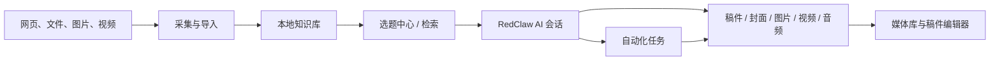
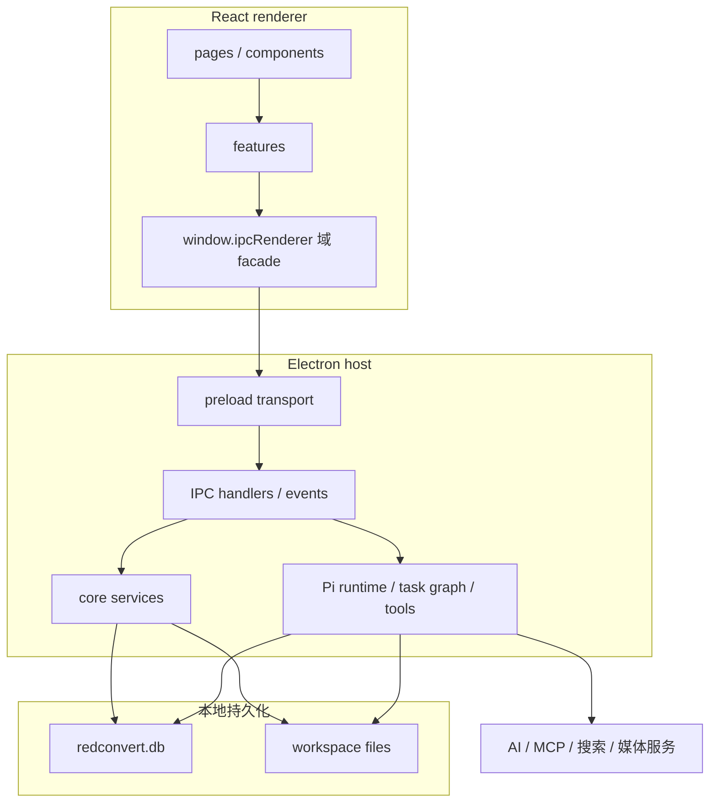

# Bojin 项目架构

## 1. 项目定位

Bojin 是一个本地优先的 AI 内容运营桌面工作区，目标是把素材采集、知识沉淀、选题、写作、视觉生成、稿件编辑和自动化执行串成一条可持续复用的内容生产链。

本仓库包含两类主要应用：

- `desktop/`：Electron + React + TypeScript 桌面应用，负责业务数据、AI 编排、文件系统、媒体处理和主要 UI。
- `Plugin/`：Chrome / Edge Manifest V3 扩展，负责网页采集和浏览器控制。

根 `README.md` 是极简项目说明；本文描述代码的实际结构和边界。

## 2. 核心业务链路



系统的主线不是一次性聊天，而是让来源、会话、任务和最终产物都能落到本地空间中继续复用。

## 3. 仓库结构

```text
redclaw/
├── desktop/                   Electron 桌面应用
│   ├── src/                   React renderer
│   │   ├── pages/             页面级产品表面
│   │   ├── features/          可复用业务域逻辑
│   │   ├── components/        通用组件和编辑器
│   │   ├── bridge/            renderer 的宿主能力 facade
│   │   ├── runtime/           runtime 事件归一化与分发
│   │   └── vendor/freecut/    vendored 视频编辑器能力
│   ├── electron/              Electron 主进程
│   │   ├── main.ts            窗口、启动流程和 IPC 注册
│   │   ├── preload.ts         contextBridge 传输层
│   │   ├── db.ts              SQLite schema 与数据访问
│   │   ├── pi/                当前 AI 对话执行实现
│   │   └── core/              AI、工具、知识、媒体和后台服务
│   ├── builtin-skills/        可同步的内置 Skills
│   ├── scripts/               构建准备与一致性检查
│   └── Docs/                  功能技术参考
├── Plugin/                    浏览器扩展源码和构建脚本
├── Docs/                      当前开发、部署和使用文档
├── README.md                  极简项目说明
└── LICENSE                    许可证
```

`desktop/dist/`、`desktop/dist-electron/`、`desktop/release/` 和 `Plugin/dist/` 都是生成产物，不应手工修改。

## 4. 运行时分层



### 4.1 Renderer

- 入口是 `desktop/src/main.tsx`，启动时安装 IPC bridge、主题、国际化、诊断和 React 根组件。
- `desktop/src/App.tsx` 是应用壳，按需加载页面，并处理全局导航、认证降级、迁移、反馈和运行状态保持。
- 页面不使用 URL router；当前视图由 `features/app-shell/useViewNavigation.ts` 中的 `ViewType` 和本地状态控制。
- renderer 业务代码应通过 `window.ipcRenderer.<domain>` 调用宿主，不在页面中散落裸 `invoke` / `listen`。
- `src/runtime/runtimeEventStream.ts` 负责把统一 runtime 事件和历史 chat 事件按 session/task/runtime 维度归一化，防止并行会话串流。

当前侧边栏直接暴露：

| 入口 | 主要页面 | 作用 |
| --- | --- | --- |
| 新对话 | `pages/RedClaw.tsx` | AI 会话、创作、任务和稿件入口 |
| 知识库 | `pages/Knowledge.tsx` | 素材、文档、视频、检索和转录 |
| 资产库 | `pages/Subjects.tsx` | 品牌、角色、物品、场景和复用参考资产 |
| 自动化 | `pages/Automation.tsx` | 定时 RedClaw 任务和执行状态 |
| 自由创作 | `pages/GenerationStudio.tsx` | 图片、视频、音频、封面和数字人生成 |
| 选题中心 | `pages/Wander.tsx` | 素材漫步、发散和选题转创作 |
| 设置 | `pages/Settings.tsx` | AI 源、工作空间和运行配置 |

`Skills`、`Archives`、`MediaLibrary`、`CoverStudio`、`Approval` 和稿件编辑器仍是可挂载页面或辅助表面，但不一定作为一级导航长期显示。

### 4.2 Preload 与 bridge

`desktop/electron/preload.ts` 只暴露 `__RED_ELECTRON_IPC__` 传输对象；`desktop/src/bridge/ipcRenderer.ts` 再组合成按领域划分的 facade。主要域包括：

- `chat`、`sessions`、`runtime`、`teamRuntime`
- `knowledge`、`manuscripts`、`media`、`subjects`
- `generation`、`cover`、`videoEditorV2`
- `redclawRunner`、`backgroundTasks`、`work`
- `skills`、`mcp`、`tools`
- `settings`、`spaces`、`app`、`logs`

bridge 层同时承担超时、返回值归一化和开源版能力降级。生产专有后端不存在时，部分 facade 会返回稳定的 unavailable/空态，而不是让页面崩溃。

### 4.3 Electron 主进程

`desktop/electron/main.ts` 是当前最集中的集成入口，包含窗口生命周期、协议注册、后台服务启动和大量 IPC handler。IPC 按 channel 前缀分域，主要包括：

- 会话与 AI：`chat:*`、`ai:*`、`runtime:*`、`sessions:*`
- 协作与任务：`team-runtime:*`、`tasks:*`、`work:*`、`review:*`
- 内容数据：`knowledge:*`、`manuscripts:*`、`archives:*`、`subjects:*`
- 媒体：`generation:*`、`media:*`、`cover:*`、`videoEditorV2:*`
- 扩展：`skills:*`、`mcp:*`、`plugin:*`
- 系统：`settings:*`、`spaces:*`、`logs:*`、`window:*`

应用启动采用分阶段策略：

1. 注册本地资源协议并尽快创建窗口。
2. 初始化核心服务和可选官方功能桥。
3. 建立当前空间目录、后台任务注册表和 RedClaw runner。
4. 延迟启动记忆维护、助手 daemon、任务队列、顾问 YouTube runner 和文件监听。
5. 更晚检查 `yt-dlp`，避免阻塞首次可交互时间。

关闭应用时会统一停止 HTTP 服务、RedClaw runner、助手 daemon、headless workers 和 session bridge。

## 5. AI 与任务编排

### 5.1 对话执行

当前对话实现基于 `desktop/electron/pi/PiChatService.ts`。`electron/agent.ts` 中的 `LangGraphChatService` 只保留兼容类名，内部已经转到 Pi 实现。

用户消息的主要链路是：

1. renderer 通过 `chat:send-message` 发送会话、消息、附件和结构化 task hints。
2. 主进程持久化用户消息，检查模型输入能力并准备附件。
3. `AgentRuntime` 根据 `runtimeMode` 和结构化 metadata 选择 intent、角色、思考预算及是否进入协调器。
4. 普通会话交给 `PiChatService`；长任务、自动化或显式多 Agent 请求交给 task graph 和 `LongTaskCoordinator`。
5. token、工具、阶段、错误和完成事件流回 renderer，同时写入 transcript、checkpoint 和 tool-result 存储。

系统不会优先用用户文本关键词硬编码判断复杂意图。路由主要依赖 runtime mode、显式 intent、附件类型、任务 ID 和 `forceMultiAgent` 等结构化元数据。

### 5.2 Runtime 模式与角色

Runtime 模式：

- `redclaw`
- `knowledge`
- `chatroom`
- `advisor-discussion`
- `background-maintenance`

内置协作角色：

- `planner`：拆解目标和阶段。
- `researcher`：检索、证据和素材摘要。
- `copywriter`：成稿、标题和发布文案。
- `image-director`：封面、配图和视觉执行。
- `reviewer`：校验需求、工具回执和真实落盘。
- `ops-coordinator`：长任务、自动化和恢复。

`TaskGraphRuntime` 为不同 intent 构建 route、plan、retrieve、tool、review、save、complete 等节点，并把任务状态落入 SQLite。`LongTaskCoordinator` 负责持续推进、恢复和后台执行。

### 5.3 Skills、工具与 MCP

- Skills 从内置目录、用户目录、兼容的 Claude 目录和项目目录发现，同名 Skill 按作用域覆盖。
- Skill 激活后，说明、允许工具、基础目录和少量样本文件会注入运行时上下文。
- 工具由 `core/tools/` 和 `toolRegistry.ts` 注册，运行时权限由工具描述、tool pack 和上下文共同约束。
- 需要人工确认的工具通过 permission request 进入 UI 或外部 session bridge。
- MCP 配置保存在设置中，主进程负责连接、列举工具/资源、调用和断开。

## 6. 数据与持久化

### 6.1 SQLite

数据库文件是：

```text
<Electron app.getPath('userData')>/redconvert.db
```

`desktop/electron/db.ts` 负责 schema 初始化和迁移。主要表包括：

- 设置与空间：`settings`、`spaces`
- 创作档案：`archive_profiles`、`archive_samples`
- 会话：`chat_sessions`、`chat_messages`
- Runtime 审计：`session_transcript_records`、`session_checkpoints`、`session_tool_results`、`runtime_events`
- Agent 任务：`agent_tasks`、`agent_task_traces`
- ACP：`acp_runs`、`acp_run_events`、`acp_artifacts`
- 记忆与索引：`user_memories`、`knowledge_vectors`、`file_index_lanes`、`file_index_events`
- 稿件和知识索引：`manuscript_embeddings`、`manuscript_similarity_cache`、`document_knowledge_index`
- 选题历史：`wander_history`

数据库会探测旧产品名对应的 userData 目录，并在当前数据库为空时迁移历史 `redconvert.db`。

### 6.2 工作空间

默认工作空间是：

```text
~/.redconvert
```

可以在设置中改为其他绝对目录。多空间默认使用：

```text
<workspace>/spaces/<space-id>/
├── skills/
├── knowledge/
│   ├── redbook/
│   ├── youtube/
│   └── docs/
├── advisors/
├── manuscripts/
├── media/
├── cover/
├── subjects/
├── redclaw/
│   └── profile/
├── memory/
├── archives/
└── chatrooms/
```

为兼容旧版本，如果默认空间目录还不存在、而工作空间根目录已经有历史内容，默认空间会直接复用根目录。

SQLite 更适合结构化状态、查询和审计；workspace 文件更适合用户可见的素材、稿件、媒体和可备份产物。完整迁移必须同时处理两者。

### 6.3 本地资源协议

媒体文件通过 `redbox-asset://`（兼容 `local-file://`）加载。主进程会把请求路径解析为本地路径，并检查是否位于允许根目录中。新增文件读取能力时应继续复用 `localAssetManager.ts` 的路径规范化和根目录校验，不能直接拼接不可信路径。

## 7. 主要业务域

### 7.1 知识库

知识库可聚合小红书、YouTube、网页摘录、普通文档、跟踪文件夹和 Obsidian vault。内容主体保存在 workspace，目录和索引状态保存在 JSON/SQLite。

当前存在多种检索能力：

- 文档 catalog 与文件索引。
- 关键词检索。
- 可配置 embedding 与向量表。
- 视觉索引和视频转录相关入口。

代码中仍保留较早的 hybrid/vector 实现，因此修改检索时要先确认调用链，不要把“代码仍存在”等同于“当前 UI 默认使用”。

### 7.2 稿件与视频编辑

稿件通常位于 `manuscripts/`。主进程支持普通 Markdown 稿件、包稿、布局状态、素材绑定、时间线片段和导出 HTML。

`src/vendor/freecut/` 提供视频时间线、预览、转场、波形、IndexedDB 和渲染基础；业务适配应尽量放在外层，减少对 vendored 深层代码的侵入。Remotion、FFmpeg 和 mediabunny 分别承担部分合成、导出和媒体读取能力。

### 7.3 媒体与生成任务

图片、视频、音频、封面、音色克隆和数字人请求统一投影为持久化 generation job。renderer 的 generation feed 只是视图，真实队列状态由主进程 `mediaGenerationJobRegistry` 管理。

产物可进入媒体库、绑定稿件或作为后续生成参考。不同任务可按前台自由创作和后台 Agent 队列区分。

### 7.4 自动化与后台运行

RedClaw runner 支持定时任务、长周期任务、立即运行、暂停/启用和执行历史。创建自动化时保存的是结构化 schedule 和 prompt；到期后由后台 runner 创建任务并调用相同 AI runtime。

窗口关闭后的行为依平台和配置而异。Linux/Windows 会在存在需要保活的 runner/daemon 时继续后台运行；macOS 关闭窗口通常不会立即退出应用。真正退出应用会停止后台服务。

### 7.5 外部 Agent 和渠道

- `SessionBridgeService` 默认监听 `127.0.0.1:31957`，提供带随机 token 的 HTTP/WebSocket 会话桥，外部 Agent 可读取 session snapshot、发送消息和处理工具授权。
- `AssistantDaemonService` 默认配置端口为 `31937`，但默认禁用；启用后可承载 relay、飞书、微信和 ACP gateway。
- 这些接口应保持 loopback 或受控网络范围，不应把 token、API key 或未授权文件路径暴露到公网。

## 8. 浏览器插件边界

`Plugin/` 的当前源码是 Manifest V3 扩展，包含：

- 小红书结构化采集和批量任务。
- YouTube、公众号、普通网页和选中文字采集。
- 多平台识别、side panel 和任务历史。
- AI 浏览器控制、CDP、DOM 操作、下载和截图。

内容采集使用 Native Messaging 和本地 Desktop Bridge：

```text
页面 → Chrome extension → Native Host → Desktop Bridge → Electron 知识库
```

Electron 入口会先识别固定官方扩展 origin：普通启动进入完整应用，Native Messaging 启动进入无窗口 Host。Host 使用 Chrome 长度帧，经 schema v2 描述文件和独立 token 连接 protocol v1 UDS/Windows Named Pipe。Bridge 对 origin、协议、请求大小和 typed allowlist 做校验，集中触发知识库变更事件。

旧 `127.0.0.1:23456` 采集服务仅作为显式环境变量开启的兼容代码保留，默认不监听。当前 allowlist 只覆盖内容采集；AI 浏览器控制和 `accounts.*` 不在该 Bridge 范围内。

## 9. 构建与发布

桌面应用使用 Vite 构建 renderer 和 Electron main/preload，使用 `electron-builder` 打包。构建前会：

1. 探测并编译可选 `desktop/private/` 功能；开源仓库中不存在时生成稳定空实现。
2. 准备浏览器插件 runtime 目录。
3. 检查或安装 `ffmpeg-static` 二进制。
4. 同步 prompt library、builtin skills 和 worker scripts。

原生依赖包括 `better-sqlite3` 和 FFmpeg，需要针对当前 Electron/平台正确安装或重建。

浏览器扩展使用 esbuild 把 `Plugin/src/` 构建到 `Plugin/dist/extension/`。

## 10. 当前已知边界与技术风险

| 项目 | 现状 | 开发影响 |
| --- | --- | --- |
| 品牌与版本 | Bojin、Bojin、Bojin 名称并存；桌面和插件版本不同 | 不要批量替换兼容标识；展示名与协议名分开处理 |
| 开源/生产差异 | `desktop/private/` 和生产 Desktop Bridge 未包含 | 官方登录、会员和部分集成会明确降级 |
| 主进程体积 | `electron/main.ts` 集中大量 IPC；`db.ts` 集中 schema/DAO | 新能力优先放 `core/` 服务，只在 main 注册薄 handler |
| IPC 与 WebView 边界 | preload 暴露通用 IPC 传输，窗口同时启用 `webviewTag` | 新 channel 必须在主进程校验参数、来源和路径；逐步收敛 channel 白名单与导航策略 |
| 本地密钥 | API Key、代理和 MCP 配置保存在 SQLite，当前没有系统钥匙串加密层 | 数据库和诊断包都应按敏感文件保护，日志不得记录凭据 |
| 插件闭环 | 插件构建可用，但生产 Native Bridge 与 Electron 快照未闭环 | 本地部署需补桥或限定为独立 UI 验证 |
| 检索实现 | 新旧 catalog、关键词和向量实现并存 | 修改前先追踪当前页面实际 channel 与 service |
| 自动测试 | 桌面业务暂无统一 test script；大量测试集中在 vendored FreeCut | 至少运行 parity/type 检查并做业务 smoke test |
| 历史文档 | 部分模块 README 含旧绝对路径，ROADMAP 仍是早期版本 | 以当前代码和本目录文档为准 |

## 11. 扩展功能时的落点

| 需求 | 推荐修改位置 |
| --- | --- |
| 新页面或页面编排 | `desktop/src/pages/` |
| 多页面共享业务逻辑 | `desktop/src/features/<domain>/` |
| 通用 UI | `desktop/src/components/` |
| 新宿主调用 | `desktop/src/bridge/domains/` + `electron/main.ts` 薄 handler |
| 文件、网络或后台业务 | `desktop/electron/core/` |
| 新 AI 工具 | `desktop/electron/core/tools/` 和工具 catalog |
| 新运行时路由信号 | typed metadata、runtime context、tool contract |
| SQLite 状态 | `desktop/electron/db.ts`，包含幂等迁移 |
| 用户可见产物 | 当前 space 的 workspace 目录 |
| 插件站点适配 | `Plugin/src/`，平台解析与通用 capture runtime 分离 |

新增 IPC 的最小闭环是：主进程校验输入并注册 channel → renderer domain bridge 提供 typed wrapper → 页面消费 → 成功/失败/超时路径验证。不要让页面绕过 bridge，也不要用脆弱的用户消息关键词代替结构化路由。

## 12. 建议验证矩阵

| 变更范围 | 最低验证 |
| --- | --- |
| Renderer | `pnpm check:types`、目标页面切换、错误/空态 |
| Bridge / IPC | `pnpm check:bridge-domains`、成功/失败/超时、事件解绑 |
| 主进程 / 数据 | 新旧数据库启动、空间切换、路径越界检查 |
| AI runtime | 普通会话、取消、工具确认、长任务恢复、并行会话隔离 |
| 媒体 | 导入、生成队列、取消/重试、产物落盘、导出 |
| 插件 | `pnpm build`、可加载扩展、真实浏览器与真实桥接 smoke |
| 打包 | `pnpm build:nosign`、安装后冷启动、workspace 迁移和退出清理 |
