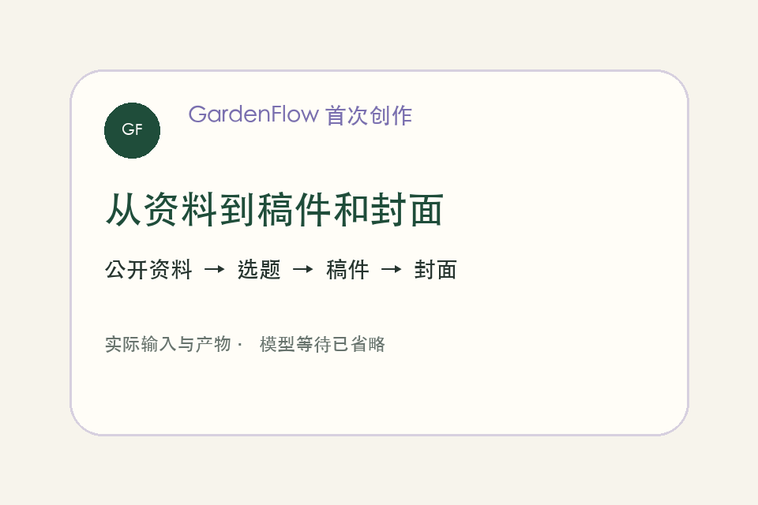
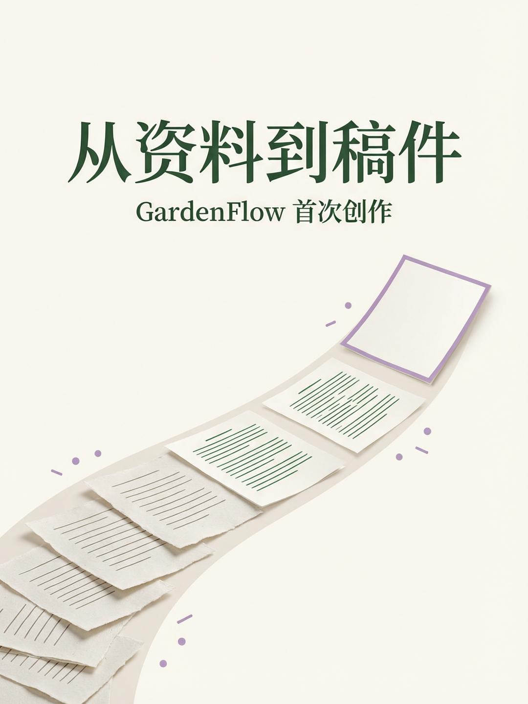

# GardenFlow 演示与验证记录

[首页](../README.md) · [首次创作教程](./FIRST_CREATION.md) · [输入资料与提示词](../examples/first-creation/README.md)

本页记录“用 GardenFlow 介绍 GardenFlow”的实际运行情况。演示长度是剪辑后的观看时长，不代表模型运行耗时。未完成的操作不会用模拟聊天或生成的界面截图代替。

## 22 秒流程预览

预览使用本次隔离 QA 的真实输入截图、选题结果、人工核对稿和封面产物。它是截图切换，不是连续操作录屏；模型等待已省略。实际模型与耗时见下方记录。

## 验证状态

| 项目 | 状态 |
| --- | --- |
| v0.0.1 五个平台/格式下载资产 | 已通过 GitHub API 核对五个安装包的文件名和非零大小；macOS arm64 DMG 已实际下载并通过 SHA-256 校验 |
| macOS arm64 干净配置启动 | 已通过隔离 `userData` 和 workspace 验证；未配置时路由禁用，错误提示准确 |
| 文本可用、图片服务未配置 | 已用只保留文本模型的独立配置核对：图片路由为 `disabled`、图片字段为空、图片能力模型为 0；界面对应“未添加生图模型”，教程指向单独配置图片能力，文字稿不受影响 |
| 浏览器插件未连接 | 已核对状态与恢复动作：未准备时引导“准备浏览器插件”，已准备但未连接时引导在扩展页加载导出目录；与首次教程一致 |
| macOS x64 / Windows x64 / Linux x64 安装 | 未在对应系统实测 |
| 模型配置同步 | 已在真实流程前同步文本、图片、视频、向量等配置到权限为 `600` 的临时数据库；未复制业务数据或输出凭据 |
| 本次资料导入、选题、稿件保存 | 已在隔离空间导入示例资料；`qwen3.8-max` 生成三个角度并保存选题稿，随后保存介绍稿；人工核对版已加入案例目录 |
| 本次封面生成与媒体文件 | `qwen-image-2.0-pro-2026-06-22` 已生成 1080×1440 PNG；结果流与媒体库均可回看，案例副本已加入仓库 |
| 20～30 秒演示、2～3 分钟操作视频 | 22 秒真实输入与产物预览已完成；2～3 分钟连续操作视频待录制 |
| 3 位陌生读者首屏理解测试 | 待真实用户反馈，不以内部检查代替 |

本次 v0.0.1 实测还发现两处显示问题：模型保存的稿件在封面选择器中显示为“未命名”，选中后生成的媒体记录仍显示“未绑定”；图片已经实际保存。Agent 回复完成后，结果流任务卡仍可能保留“运行中”，但媒体库可找到并预览成品。演示和教程以实际文件与媒体库为完成依据，不用状态文字代替产物检查。

## 实测记录要求

记录版本、系统、模型 ID、协议、请求开始/结束时间、实际产物和人工修改。公开记录不包含密钥、个人绝对路径、供应商私有地址或原始诊断日志。使用[运行记录模板](./launch/run-record.md)整理证据。

## 本次实际产物

- [人工核对后的介绍稿](../examples/first-creation/output/gardenflow-intro.md)
- [3:4 首次创作封面](../examples/first-creation/output/gardenflow-first-creation-cover.png)

