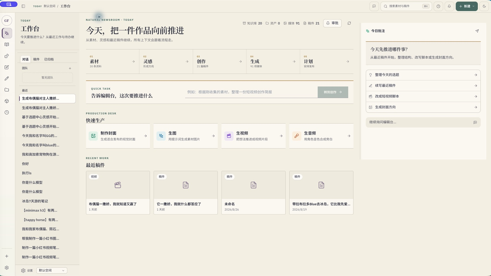
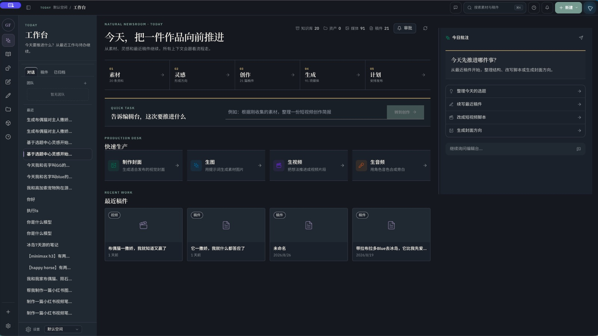
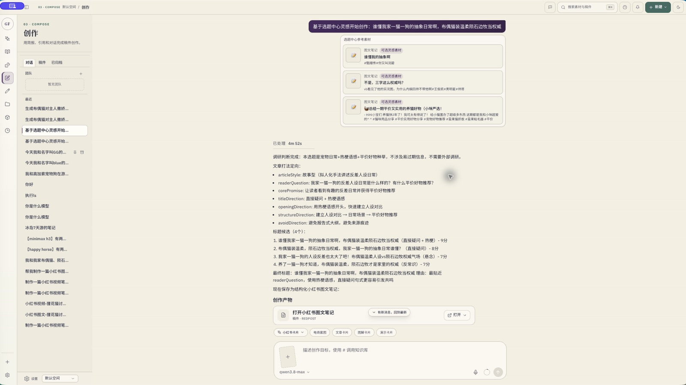
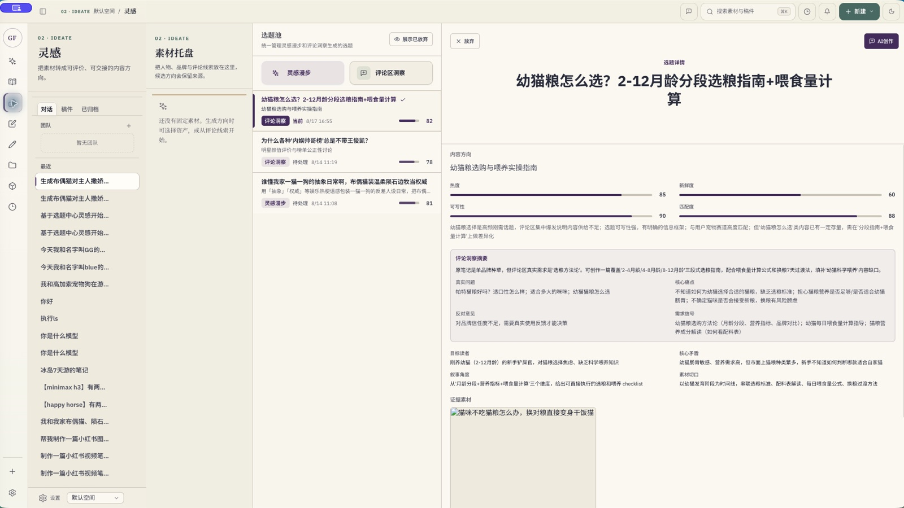
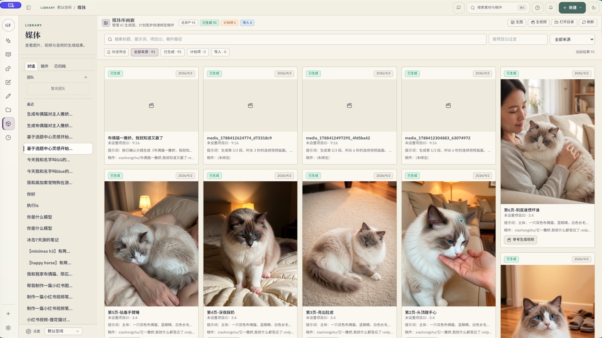
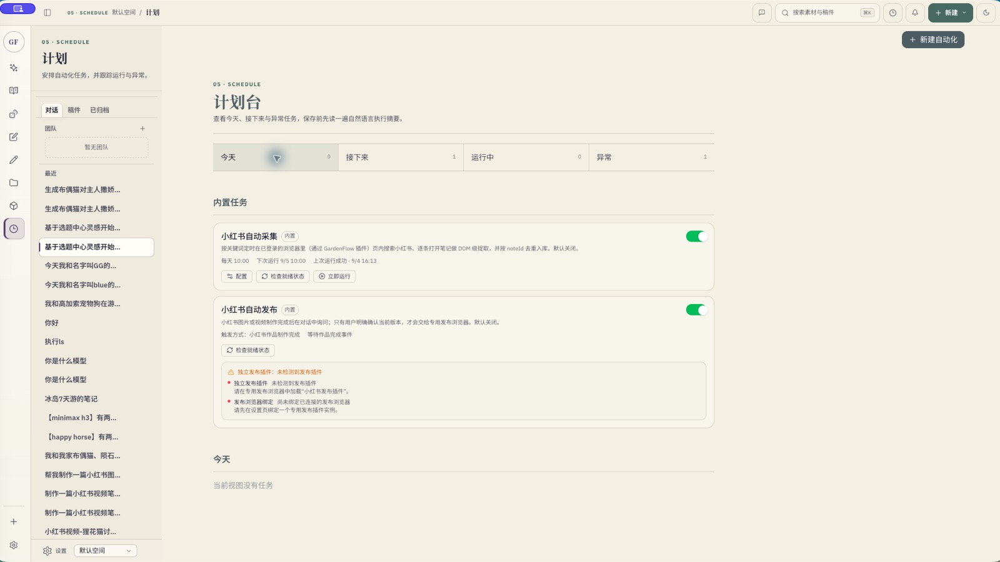

# 「自然编辑部」界面规范

## 目标

新版桌面端面向需要从资料收集一路完成内容生产的创作者。界面用一条明确的创作流程回答“我现在在哪、下一步做什么、上下文去了哪里”，同时保留高频用户所需的快速切换、批量引用和任务状态。

浅色工作台：

深色工作台：

## 信息架构

一级入口按流程与资源重组：

1. 工作台
2. 素材
3. 灵感
4. 创作
5. 生成
6. 资产
7. 媒体
8. 计划

设置、空间与通知留在外围工具区。工作台是新用户默认入口；已有用户仍恢复上次合法页面。页面交接使用 `FlowStage`、`FlowHandoff` 和 `flow.open`，素材引用通过现有 `PendingChatMessage` / `GenerationIntent` 传递，不根据消息关键词猜测路由。

## 视觉语言

“自然编辑部”结合纸质编辑台、田野笔记和生产工作台：

- 纸张 `#F3F0E5`
- 墨色 `#252B32`
- 苔绿 `#49675E`
- 麦金 `#C7923E`
- 鸢尾 `#5A4278`

鸢尾只用于品牌、焦点和选中状态，不使用紫色渐变。页面以分栏、页签、批注线、序号和纸张层次建立结构，减少玻璃拟态、悬浮卡片和装饰性阴影。

字体随应用本地打包：正文与控件使用 IBM Plex Sans 和 Noto Sans SC，页面标题与章节标题使用 Noto Serif SC。字体声明与 SIL OFL 1.1 位于 `desktop/public/licenses/`。

## 布局

- 64px 流程轨道：一级阶段与外围工具。
- 约 236px 上下文书架：当前阶段说明、会话/来源和下一阶段。
- 弹性主画布：列表、编辑器或结果流。
- 360–480px 检查器：详情、引用、生成配方或 AI 协作。

窗口最小尺寸为 960×680。低于 1040px 时上下文书架和检查器使用覆盖式抽屉，主操作不产生水平滚动；灵感桌在常用桌面宽度保留素材、方向、评价三栏，在更窄窗口收起素材托盘。

## 交互

- `Cmd/Ctrl+K`：全局搜索。
- `Cmd/Ctrl+N`：统一新建菜单。
- `Esc`：关闭最上层菜单、搜索或抽屉。
- 交互图标统一使用 Lucide；主要点击区域至少 36px。
- 页面、抽屉和任务状态动画为 140–220ms，并遵循 `prefers-reduced-motion`。
- 首次加载显示骨架；刷新保留旧内容，只显示局部进度；错误状态包含可见的重试动作。

## 页面模式

- 工作台：流程地图、继续创作、最近稿件、待审批、素材统计与快速任务。
- 创作：以创作简报开始，目标、受众、素材和交付形式常显；会话位于上下文书架，文件预览进入检查器。
- 素材 / 资产 / 媒体：来源或筛选、主列表/画廊、详情检查器的资源浏览模式。
- 灵感：素材托盘、候选方向、评价与约束三栏。
- 生成：结果流与生成配方并列，任务明确显示排队、运行、完成、失败、取消与重试。
- 计划：今天、接下来、运行中、异常四个视图；编辑时展示自然语言执行摘要。
- 稿件：正文画布与 AI、大纲、引用、结果检查器；保存状态固定可见。
- 设置：可搜索的两级分类；常用与 AI 优先，高级项折叠。

创作简报与灵感桌分别体现“交接后再写作”和“带着素材做判断”的核心结构：

素材库、媒体库和计划台延续同一套资源浏览与运行状态语言：

## 维护规则

新页面优先复用 `features/workbench/WorkbenchPrimitives.tsx` 中的页面标题、筛选栏、批量操作栏、检查器、状态面板和资源浏览器。不要新增文本关键词路由，不要在 renderer 中绕过现有 bridge，也不要用新的业务表或 IPC 通道承载纯界面状态。
