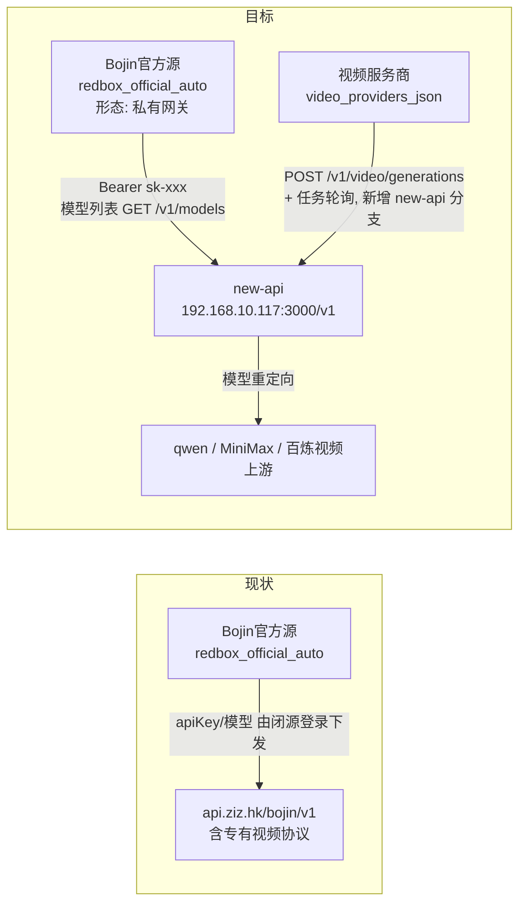

> 历史记录：本文保留更名前的实际名称和验证结论，不代表 GardenFlow 新模型网关已可用。当前更名与验收见 [GardenFlow 更名说明](GARDENFLOW_REBRAND.md)。

# 「Bojin官方」模型源切换到私有化 new-api 网关 — 实现方案

最后更新：2026-08-19（v2：新增视频渠道 `bojin-video-1.1-r2v` / `bojin-video-H3`，视频生成从「暂缓」改为「适配 new-api 视频任务协议」）
状态：方案设计（待评审）

---

## 1. 背景与目标

当前桌面端的「Bojin官方」AI 源指向云端官方网关 `https://api.ziz.hk/bojin/v1`，其 apiKey 与模型列表依赖闭源 `desktop/private/` 登录模块（本仓库不含该目录，官方登录为降级桩）。

目标：将「Bojin官方」源整体切换到内网私有化部署的 [new-api](https://docs.newapi.pro/zh/docs) 网关：

- 网关地址：`http://192.168.10.117:3000/`（OpenAI 兼容，AI 源 baseURL 填 `http://192.168.10.117:3000/v1`）
- 鉴权：new-api 令牌 `Authorization: Bearer sk-xxx`（不再依赖官方账号登录）
- new-api 侧已通过「渠道模型重定向」配置好对外模型名（客户端只需请求 `bojin-*` 名称）：

| 对外模型名（客户端请求） | 上游真实模型 | 用途 |
|---|---|---|
| `bojin-max` | qwen3.8-max | 聊天（旗舰） |
| `bojin-plus` | qwen3.7-plus | 聊天（轻量） |
| `bojin-omni-plus` | qwen3.5-omni-plus-2026-03-15 | 音视频多模态分析 |
| `bojin-imgae-2.0` | qwen-image-2.0-pro-2026-06-22 | 图片生成 |
| `bojin-imgae-3.0` | qwen-image-3.0-pro | 图片生成 |
| `bojin-text-embedding` | qwen3.7-text-embedding | 向量 |
| `bojin-speech` | MiniMax/speech-2.8-hd | 语音合成 TTS |
| `bojin-asr-plus` | qwen-audio-3.0-asr-flash | 语音转录 ASR |
| `bojin-video-1.1-r2v` | happyhorse-1.1-r2v（阿里百炼渠道） | 参考图生视频 |
| `bojin-video-H3` | MiniMax-H3（MiniMax 渠道） | 文生/参考/首尾帧视频 |

> 注意：`bojin-imgae-*` 的拼写是 **imgae**（非 image）。本方案按该拼写适配；若 new-api 侧可改名为 `bojin-image-*`，客户端能力推断可少一条特判（见 §6.3）。
> `bojin-video-H3` 存在网关侧版本风险：`MiniMax-H3` 是 MiniMax V2 API 独有模型，而 new-api 的 MiniMax 视频适配器截至 v1.0.0-rc.25 写死 V1 端点，详见 §6.9.5。

---

## 2. 现状分析（官方源全链路）

### 2.1 定义与常量

- 官方源 baseURL 唯一定义点：`desktop/shared/bojinVideo.ts:9`
  `REDBOX_OFFICIAL_VIDEO_BASE_URL = \`https://api.ziz.hk/${APP_BRAND.variant}/v1\``（variant=`bojin`）
  该常量同时承担「官方 AI 网关」与「官方视频网关」两个角色。
- 官方源定义：`desktop/src/config/aiSources.ts`
  - `OFFICIAL_AUTO_SOURCE_ID = 'redbox_official_auto'`（第 31 行，持久化契约，**不可改**）
  - 显示名 `OFFICIAL_AI_SOURCE_DISPLAY_NAME = 'Bojin官方'`（第 48 行）
  - 工厂 `createOfficialAiSource()`（第 50-64 行）：presetId=`redbox-official`，baseURL 取上述常量，apiKey/models 为空
  - preset 列表首项 `redbox-official`（第 68 行）

### 2.2 鉴权（现状为闭源登录，本仓库是桩）

- 设计流程：官方账号登录（短信/微信）→ 闭源 `desktop/private/electron/redboxAuthService` 下发 session（`accessToken` + `apiKey`）→ 写入 `ai_sources_json` 官方源条目与扁平 `api_key`。
- 本仓库无 `desktop/private/`：`desktop/electron/appMain.ts` 约 3739-3816 行注册的 `redbox-auth:*` IPC 全部返回 unavailable。
- UI 开关：`desktop/src/config/runtimeFeatures.ts:8` — `VITE_OFFICIAL_ACCOUNT_AUTH`（默认 false）→ `hasOfficialAiPanel=false`（`desktop/src/features/official/index.ts:14`）。
- 关键 UI 阻塞点：
  - `desktop/src/pages/Settings.tsx:2118-2129` — `hasOfficialAiPanel=false` 时 `displayedAiSources` **过滤掉官方源**（设置页看不到）。
  - `desktop/src/pages/Settings.tsx:2165` — 官方源未登录时聊天模型列表强制为空。
  - `desktop/src/pages/Settings.tsx:7696` — 路由模式选择器仅在 `hasOfficialAiPanel=true` 时显示「官方」选项。
  - 官方源展开区不渲染 baseURL/apiKey 输入框，只显示登录态（约 7441 行）。

### 2.3 模型列表与能力标注

- 自定义源模型列表走 `desktop/electron/core/aiSourceService.ts:233-270` `fetchOpenAiModels`（`GET {base}/models`，Bearer 鉴权，多候选路径）——**new-api 完全兼容**。
- 官方源模型列表设计上由登录服务下发（本仓库为空）。
- 能力标注（决定模型出现在哪个功能的下拉列表里）：`desktop/shared/modelCapabilities.ts`
  - 能力枚举：`chat/image/video/audio/tts/voice_clone/transcription/embedding`（第 3-11 行）
  - 判定顺序：模型名强制规则（第 72-81 行，`asr`→transcription、`tts`/`voice`→tts、`clone`→voice_clone）→ `desktop/shared/modelProfiles.json` 正则档案 → 通用关键词（第 63-70 行）→ 默认 `chat`
  - 特殊策略：模型名含 `omni` 的强制**移出聊天列表**（第 83-85 行）；仅名称含 `omni` 的模型允许 video 输入（第 118-120 行）

**10 个模型按现有规则的推断结果（改造前）：**

| 模型 | 推断结果 | 是否正确 |
|---|---|---|
| `bojin-max` / `bojin-plus` | chat（输入 image+file） | ✅ |
| `bojin-text-embedding` | embedding | ✅ |
| `bojin-speech` | tts（命中 `/\bspeech\b/`） | ✅ |
| `bojin-asr-plus` | transcription（强制规则 `asr`） | ✅ |
| `bojin-video-1.1-r2v` / `bojin-video-H3` | video（命中 `/video/i`） | ✅ |
| `bojin-imgae-2.0` / `3.0` | **chat（误判！`imgae` 不命中 `/image/i`）** | ❌ 必须修 |
| `bojin-omni-plus` | **空能力（含 `omni` 被剔出 chat，又无档案规则兜底）** | ❌ 必须修 |

### 2.4 任务路由与持久化

- 12 个任务 scope：`desktop/src/features/settings/settingsModel.ts:226-264` — `chat/wander/team/knowledge/redclaw/transcription/embedding/image/visualIndex/videoAnalysis/voiceTts/voiceClone`，默认全部 `mode:'official'`、`sourceId: redbox_official_auto`。
- 持久化在 SQLite `settings` 表（非 electron-store）：`ai_sources_json`（多源）、`ai_model_routes_json`（路由，存 `settings_extra_json`）、以及保存时（`Settings.tsx` 约 6482-6544 行）扁平化出的运行时字段：

| scope | 扁平字段（主进程实际读取） |
|---|---|
| chat 等聊天类 | `api_endpoint` / `api_key` / `model_name`（+ `model_name_knowledge` 等） |
| transcription | `transcription_endpoint` / `transcription_key` / `transcription_model` |
| embedding | `embedding_endpoint` / `embedding_key` / `embedding_model` |
| image | `image_endpoint` / `image_api_key` / `image_model` / `image_provider` / `image_provider_template` |
| voiceTts | `voice_endpoint` / `voice_api_key` / `voice_tts_model` |

- 归一化/迁移：`desktop/src/pages/settings/shared.tsx:1101-1150` `parseAiSources` 会把旧 id/name 规范为 `redbox_official_auto`，但 **baseURL 原样保留**；`desktop/electron/appMain.ts:1321-1346` `normalizeAiSourceListJson` 只做 URL 去尾斜杠。⇒ 老库中官方源 baseURL 不会自动跟随代码常量更新，**需要显式迁移**（见 §6.7）。

### 2.5 各能力的实际请求端点（主进程）

| 能力 | 实现位置 | URL 拼接 | 协议 | new-api 兼容性 |
|---|---|---|---|---|
| 聊天 | `desktop/electron/pi/PiChatService.ts` | `{base}/chat/completions`（流式+工具，经 pi-agent-core） | OpenAI | ✅ |
| 转录 | `desktop/electron/appMain.ts:14554+`；`core/video-auto-edit/asrSrtService.ts` | `{base}/audio/transcriptions`（multipart） | OpenAI | ✅（内网 IP 不命中 14588-14595 行的 dashscope/volces 拒绝逻辑；`prepareOfficialTranscriptionAuth` 官方钩子缺 private 时自动走普通分支） |
| 向量 | `desktop/electron/core/vector/EmbeddingService.ts` | `{base}/embeddings` | OpenAI | ✅ |
| 图片 | `desktop/electron/core/imageGenerationService.ts` + `imageProviderAdapters.ts` | 模板 `openai-images`：`{base}/images/generations`（图生图走 `/images/edits`） | OpenAI | ✅（须确保模板为 `openai-images`；对外名 `bojin-imgae-*` 不含 `qwen-image` 前缀，不会误切 `dashscope-wan-native` 模板） |
| TTS | `desktop/electron/core/mediaGenerationJobRegistry.ts:352-452` | `{base}/audio/speech` | OpenAI | ✅（`MiniMax/speech-*` 专有分支仅在 DashScope host 触发，内网网关不受影响，见 `shared/audioGenerationCapabilities.ts:225-234`） |
| 视频生成 | `desktop/electron/core/videoGenerationService.ts:957+`（`generateVideosToMediaLibrary`） | 按 `shared/videoProvider.ts:14-35` `resolveVideoProvider` 分流：`redbox`（api.ziz.hk 专有）/ `aliyun-bailian`（含 `happyhorse-*` 直连）/ `minimax`（含 `MiniMax-H3` 直连，V2 协议 `/v2/video_generation`）/ `openai-compatible`（本项目扩展协议 `/videos/generations(/async)`） | 专有 | ⚠️ 四个分支均不匹配 new-api 的 `/v1/video/generations` 任务协议，需新增 `new-api` 分支，见 §6.9 |
| visualIndex / videoAnalysis | 仅 settings 落盘 | — | — | 当前主进程无 HTTP 消费者，不阻塞迁移 |

### 2.6 new-api 网关能力对照（已按官方文档核实）

| 端点 | new-api 支持 | 说明 |
|---|---|---|
| `GET /v1/models` | ✅ | 按令牌分组/模型限制过滤，恰好返回 10 个 `bojin-*` |
| `POST /v1/chat/completions` | ✅ | 流式/工具调用 |
| `POST /v1/embeddings` | ✅ | |
| `POST /v1/images/generations`（`/edits`） | ✅ | qwen-image 有官方适配（百炼格式），OpenAI 标准 `prompt` 字段是否自动转换需实测 |
| `POST /v1/audio/speech` | ✅ | MiniMax 上游由渠道适配；voice 参数映射需实测 |
| `POST /v1/audio/transcriptions` | ✅ | multipart；qwen ASR 上游适配需实测 |
| `POST /v1/video/generations` + `GET /v1/video/generations/{task_id}` | ✅（需 new-api ≥ **v0.9.21**） | 异步任务协议，Bearer 鉴权；与本项目现有 `/videos/generations` 扩展协议**不兼容**，客户端需新增适配分支（§6.9）。阿里 DashScope 视频适配器 v0.9.15 起、MiniMax（hailuo）适配器 v0.9.21 起提供；另有 OpenAI Sora 风格查询 `GET /v1/videos/{video_id}` 可选 |

---

## 3. 总体方案

### 架构变化



### 设计原则

1. **保持持久化契约不变**：`redbox_official_auto`、preset `redbox-official`、12 个 scope 的 `mode:'official'` 全部保留，只换 baseURL、鉴权来源与模型列表来源。老用户数据平滑迁移。
2. **拆分「AI 网关」与「视频网关」常量**：现状两者共用 `REDBOX_OFFICIAL_VIDEO_BASE_URL`，必须解耦——AI 能力全部指向 new-api；视频经私有网关走**新增的 `new-api` 任务协议分支**（§6.9），`api.ziz.hk` 专有视频分支保留不动，直连百炼/MiniMax 分支保留作兜底。
3. **鉴权简化为令牌制**：官方源开放 apiKey 输入（baseURL 仍锁定），不再依赖官方账号登录；`VITE_OFFICIAL_ACCOUNT_AUTH` 保持 false。
4. **能力标注走结构化规则**：在 `modelProfiles.json` 增加 `bojin-*` 档案 + 官方源内置默认 `modelsMeta`，不在业务代码里散落模型名判断（符合仓库 AI System Design Rule）。

### 分期

| 阶段 | 内容 | 代码量 | 说明 |
|---|---|---|---|
| 阶段 0 | 零代码验证：用「自定义供应商」接 new-api 全链路；curl 验证视频任务链路 | 0 | 立即可做，验证网关侧配置正确性 |
| 阶段 1 | 配置层：常量拆分、preset/工厂指向 new-api、能力档案、内置模型、数据迁移 | ~1-2 天 | 核心 |
| 阶段 2 | UI/鉴权：官方源以「私有网关」形态展示、apiKey 编辑、绕过登录门、模型刷新/连通测试 | ~2-3 天 | 核心 |
| 阶段 3 | 视频生成：新增 `new-api` 视频 provider（提交 + 任务轮询适配器、能力元数据、视频供应商注入），见 §6.9 | ~2 天 | 依赖阶段 0 的视频 curl 实测结论（尤其 `bojin-video-H3`） |
| 阶段 4 | 可选：voiceClone、HTTPS、new-api 账号体系对接 | 按需 | 非阻塞 |

---

## 4. 阶段 0 — 零代码快速验证（建议先做）

不改代码，先确认 new-api 侧配置与模型全部可用：

1. 设置 → AI 供应商 → 添加自定义供应商：预设选 `Custom`，baseURL 填 `http://192.168.10.117:3000/v1`，apiKey 填 new-api 令牌 `sk-xxx`。
2. 点「拉取模型」，应返回 10 个 `bojin-*` 模型。
3. 将各任务路由切到该自定义源逐项验证（注意：此时 `bojin-imgae-*` 会因拼写问题出现在**聊天**下拉而非图片下拉、`bojin-omni-plus` 不出现在任何列表——这正是阶段 1 要修复的，不影响 chat/embedding/tts/asr 的验证）。
4. 视频链路无法通过应用 UI 验证（需阶段 3 适配器），直接用 §8.1 的视频 curl 完成实测，重点确认 `bojin-video-H3` 是否可用（§6.9.5）与参考图 URL 形态（§6.9.3）。

同时用 curl 冒烟（见 §8.1），把网关侧问题（渠道、模型映射、计费配置）在动代码前全部暴露。

---

## 5. new-api 服务端配置要求

1. **版本**：视频链路要求 new-api ≥ **v0.9.21**（阿里视频适配器 v0.9.15 起、MiniMax 视频适配器 v0.9.21 起）；建议 ≥ v0.11.0（任务查询响应才有 `result_url` 字段，更早版本成功 URL 复用 `fail_reason` 字段，见 §6.9.4）。
2. **令牌**：控制台 → 令牌 → 创建专用令牌；建议开启「模型限制」仅勾选 10 个 `bojin-*` 模型（`/v1/models` 即只返回这 10 个，客户端模型列表干净；注意视频模型也须包含在内，否则任务查询会因模型权限校验失败）；配额按需，`allow_ips` 可加固到桌面端网段。
3. **渠道**：各渠道「模型」列表必须填**对外名**（`bojin-max` 等），「模型重定向」填映射 JSON（用户已配置）。注意重定向会重构请求体，上游不支持的参数可能报错。视频两个渠道：
   - `bojin-video-1.1-r2v` → 渠道类型「阿里通义千问」（Ali/type=17），baseURL 默认 `https://dashscope.aliyuncs.com`；
   - `bojin-video-H3` → 渠道类型 MiniMax（type=35），默认 baseURL 是旧域名 `api.minimax.chat`，建议渠道内改为 `https://api.minimaxi.com`。
4. **需实测的适配点**（网关侧行为，文档未完全确认）：
   - `bojin-imgae-*`：OpenAI 标准 `{model, prompt, size}` 请求是否被自动转换为百炼 qwen-image 格式；
   - `bojin-speech`：OpenAI `{model, input, voice}` → MiniMax TTS 的 voice 参数映射（本应用默认 voice=`alloy`，MiniMax 音色 ID 体系不同，必要时在渠道「参数覆盖」里固定 voice）；
   - `bojin-asr-plus`：multipart `/v1/audio/transcriptions` → qwen ASR 的适配；
   - `bojin-video-1.1-r2v`：参考图经 `metadata.input.media` 透传是否可用、`media.url` 是否接受 data URL（§6.9.3）；
   - `bojin-video-H3`：**重大风险** — `MiniMax-H3` 是 MiniMax V2 API（`/v2/video_generation`）独有模型，new-api 的 hailuo 适配器截至 v1.0.0-rc.25 写死 V1 端点（`/v1/video_generation`），直接映射大概率上游报模型不支持。必须先 curl 实测；若不可用见 §6.9.5 备选路线。

---

## 6. 阶段 1 + 阶段 2 详细改造点

### 6.1 新增私有网关常量（拆分 AI 网关与视频网关）

新建 `desktop/shared/privateGateway.ts`（渲染层与主进程共用）：

```ts
// 私有化 new-api 网关（OpenAI 兼容）。
// 与 bojinVideo.ts 的官方视频网关（api.ziz.hk 专有协议）解耦。
export const PRIVATE_GATEWAY_BASE_URL = 'http://192.168.10.117:3000/v1';

// endpoint 是否指向私有网关（按 URL host:port 结构化比对，供 videoProvider 等分流用）
export function isPrivateGatewayEndpoint(endpoint: string): boolean {
    try {
        const target = new URL(String(endpoint || '').trim());
        const base = new URL(PRIVATE_GATEWAY_BASE_URL);
        return target.host.toLowerCase() === base.host.toLowerCase();
    } catch {
        return false;
    }
}

export const PRIVATE_GATEWAY_DEFAULT_MODELS: Array<{ id: string; capabilities: string[] }> = [
    { id: 'bojin-max', capabilities: ['chat'] },
    { id: 'bojin-plus', capabilities: ['chat'] },
    { id: 'bojin-omni-plus', capabilities: ['audio'] },
    { id: 'bojin-imgae-2.0', capabilities: ['image'] },
    { id: 'bojin-imgae-3.0', capabilities: ['image'] },
    { id: 'bojin-text-embedding', capabilities: ['embedding'] },
    { id: 'bojin-speech', capabilities: ['tts'] },
    { id: 'bojin-asr-plus', capabilities: ['transcription'] },
    { id: 'bojin-video-1.1-r2v', capabilities: ['video'] },
    { id: 'bojin-video-H3', capabilities: ['video'] },
];

// 视频模型的结构化元数据：上游渠道决定 new-api metadata 的构造形状（§6.9.3），
// 支持的生成模式决定 UI 可选项。用元数据承载路由意图，避免在业务代码里按模型名写启发式判断。
export type PrivateGatewayVideoUpstream = 'aliyun-bailian' | 'minimax';
export interface PrivateGatewayVideoModelMeta {
    id: string;
    upstream: PrivateGatewayVideoUpstream;
    modes: Array<'text-to-video' | 'reference-guided' | 'first-last-frame'>;
}
export const PRIVATE_GATEWAY_VIDEO_MODELS: PrivateGatewayVideoModelMeta[] = [
    { id: 'bojin-video-1.1-r2v', upstream: 'aliyun-bailian', modes: ['reference-guided'] },
    { id: 'bojin-video-H3', upstream: 'minimax', modes: ['text-to-video', 'reference-guided', 'first-last-frame'] },
];
```

- `REDBOX_OFFICIAL_VIDEO_BASE_URL`（`shared/bojinVideo.ts:9`）**保持不动**：`redbox` 专有视频分支仍以 api.ziz.hk 判定，互不干扰；视频经私有网关走新增的 `new-api` 分支（§6.9）。
- 如需构建期覆盖，后续可加 `VITE_PRIVATE_GATEWAY_BASE_URL`（渲染层）/`process.env`（主进程）读取，当前内网固定 IP 场景硬编码常量即可，不过度设计。

### 6.2 官方源定义指向新网关

`desktop/src/config/aiSources.ts`：

```ts
import { PRIVATE_GATEWAY_BASE_URL, PRIVATE_GATEWAY_DEFAULT_MODELS } from '../../shared/privateGateway';

// createOfficialAiSource（第 50-64 行）：
//   baseURL: REDBOX_OFFICIAL_VIDEO_BASE_URL  →  PRIVATE_GATEWAY_BASE_URL
//   models:  []                              →  PRIVATE_GATEWAY_DEFAULT_MODELS.map(m => m.id)
//   modelsMeta: []                           →  PRIVATE_GATEWAY_DEFAULT_MODELS

// AI_SOURCE_PRESETS 首项（第 68 行）：
//   { id: 'redbox-official', label: OFFICIAL_AI_SOURCE_DISPLAY_NAME,
//     baseURL: PRIVATE_GATEWAY_BASE_URL, protocol: 'openai' }
```

内置 `modelsMeta`（带 capabilities）保证离线状态下各 scope 下拉即有正确模型；在线时可用「拉取模型」刷新（§6.5）。

显示名可顺带调整（同文件第 48 行），例如 `Bojin私有网关`，让用户明确感知已切换；`isOfficialManagedSource`（`Settings.tsx:2097-2111`）与 `parseAiSources`（`shared.tsx:1114-1120`）按显示名匹配旧数据的分支保留即可继续兼容。

### 6.3 能力档案规则（修复 imgae / omni 两个误判）

`desktop/shared/modelProfiles.json` 追加（结构化规则，避免业务代码硬编码）：

```json
{
    "id": "bojin-private-chat",
    "vendor": "bojin",
    "displayName": "Bojin gateway chat family",
    "matchers": ["\\bbojin-max\\b", "\\bbojin-plus\\b"],
    "capabilities": ["chat"],
    "inputCapabilities": ["image", "file"],
    "notes": "Private new-api gateway chat models (qwen3.8-max / qwen3.7-plus upstream)."
},
{
    "id": "bojin-private-omni",
    "vendor": "bojin",
    "displayName": "Bojin gateway omni family",
    "matchers": ["bojin.*omni"],
    "capabilities": ["audio"],
    "inputCapabilities": ["image", "audio", "video", "file"],
    "notes": "Omni multimodal analysis; kept out of chat lists by the omni policy."
},
{
    "id": "bojin-private-image",
    "vendor": "bojin",
    "displayName": "Bojin gateway image family",
    "matchers": ["bojin-imgae-", "bojin-image-"],
    "capabilities": ["image"],
    "inputCapabilities": [],
    "notes": "Covers the 'imgae' spelling used by the gateway model alias."
},
{
    "id": "bojin-private-speech",
    "vendor": "bojin",
    "displayName": "Bojin gateway speech",
    "matchers": ["\\bbojin-speech\\b"],
    "capabilities": ["tts"],
    "inputCapabilities": []
},
{
    "id": "bojin-private-embedding",
    "vendor": "bojin",
    "displayName": "Bojin gateway embedding",
    "matchers": ["bojin-text-embedding"],
    "capabilities": ["embedding"],
    "inputCapabilities": []
}
```

说明：

- `bojin-asr-plus` 已被强制规则（模型名含 `asr` → transcription，`modelCapabilities.ts:75`）正确覆盖，无需档案。
- `bojin-video-*` 已被通用关键词（`/video/i` → video，`modelCapabilities.ts:68`）正确覆盖，无需档案；video 能力模型不会进入聊天/图片等下拉列表。
- `bojin-omni-plus`：档案给 `audio` 能力 + 全量输入；`omni` 策略自动将其排除出聊天列表（第 83-85 行）并放行 video 输入（第 118-120 行），与 `qwen-omni-family` 档案行为一致，可用于 videoAnalysis 路由。
- 若 new-api 侧后续把别名改为 `bojin-image-*`，`bojin-private-image` 的第二个 matcher 已预留。
- 内置 `modelsMeta`（§6.2）与档案规则**双保险**：前者服务于官方源默认清单，后者保证「拉取模型」在线刷新（new-api 的 `/v1/models` 不带能力字段，仍靠名称推断）后能力依然正确。

### 6.4 主进程模型列表拉取

无需改动：官方源 protocol 为 `openai`，`aiSourceService.fetchOpenAiModels`（`aiSourceService.ts:233-270`）对 `http://192.168.10.117:3000/v1` 会依次尝试 `/models` 候选路径，new-api 标准返回即可解析。仅需在 UI 上对官方源放开「拉取模型」按钮（§6.5）。

### 6.5 设置页 UI 改造（阶段 2 核心）

`desktop/src/pages/Settings.tsx`，在 `hasOfficialAiPanel=false`（即不启用闭源登录面板）的前提下让官方源以「私有网关」形态可见可配：

1. **展示**：`displayedAiSources`（2118-2129 行）——`hasOfficialAiPanel=false` 分支不再过滤官方源，改为：若列表无官方源则前插 `officialAiSourcePlaceholder`，有则原样展示。
2. **编辑权限**：官方源展开区（约 7335-7460 行）由「登录态提示」改为：
   - baseURL：只读展示（锁定为 `PRIVATE_GATEWAY_BASE_URL`，防手改破坏路由契约）；
   - apiKey：开放输入（持久化进 `ai_sources_json` 官方源条目，保存时经现有扁平化逻辑写入 `api_key` 等字段，主进程链路零改动）；
   - 「拉取模型」「连通测试」按钮（复用自定义源现有实现）。
3. **登录门旁路**：2165 行 `isOfficialManagedSource(chatRouteSource) && !officialAuthLoggedIn` 返回空列表的判断，改为 `!officialAuthLoggedIn && !chatRouteSource.apiKey`（有 key 即视为可用）；同理排查 `officialAuthNeedsLogin` 相关的提示分支。
4. **路由模式选择器**：7696 行「官方」选项从 `hasOfficialAiPanel` 门控改为恒定展示（或引入新的 `RUNTIME_FEATURES.privateGateway` 开关门控，推荐后者，便于品牌变体间复用）。
5. **删除保护**：官方源不可删除的现有逻辑保留。

推荐引入结构化开关而非散落判断：`desktop/src/config/runtimeFeatures.ts` 增加

```ts
privateGateway: true, // 或 isExplicitlyEnabled(import.meta.env.VITE_PRIVATE_GATEWAY)
```

UI 各处用 `RUNTIME_FEATURES.privateGateway` 表达「官方源=私有网关」形态，与 `officialAccountAuth`（闭源登录形态）互斥。

6. **OfficialLoginGate**：`VITE_OFFICIAL_ACCOUNT_AUTH` 保持 false，登录门本就不渲染，无需改动；`useOfficialAuthLifecycle` 的 bootstrap 桩调用无害，可不动。

### 6.6 默认模型路由推荐值

`ai_model_routes_json` 各 scope 的 model 留空时由 `fallbackOfficialRouteModel`（`Settings.tsx:6683`）按能力自动挑选；有了 §6.2 内置 `modelsMeta` 后自动选中如下，也可在 `settingsModel.ts` 的 `DEFAULT_AI_MODEL_ROUTES`（251-264 行）显式写死：

| scope | 推荐模型 | 备注 |
|---|---|---|
| chat / wander / team / knowledge / redclaw | `bojin-max` | 长任务/意图路由等读扁平 `api_*` 字段，随 chat 路由生效 |
| transcription | `bojin-asr-plus` | |
| embedding | `bojin-text-embedding` | 切换后需重建向量索引（维度变化） |
| image | `bojin-imgae-3.0` | `image_provider_template` 保持/设为 `openai-images` |
| visualIndex | `bojin-max` | 当前主进程无消费者，仅落盘 |
| videoAnalysis | `bojin-omni-plus` | omni 允许 video 输入 |
| voiceTts | `bojin-speech` | 默认 voice=`alloy`，映射见 §5 |
| voiceClone | `disabled` | 网关无音色克隆模型 |

视频生成不在上述 12 个 scope 内，走独立的视频服务商配置（`video_providers_json`，设置页已有编辑 UI），见 §6.9.6。

### 6.7 老数据迁移

改造后新装用户自然正确，但已有用户 SQLite 中官方源条目仍是 `api.ziz.hk`（§2.4 已证明现有归一化不会刷新 baseURL）。收口点：`desktop/src/pages/settings/shared.tsx` `parseAiSources`（1129-1139 行），对 `isOfficialSource` 分支强制：

```ts
baseURL: isOfficialSource ? PRIVATE_GATEWAY_BASE_URL : baseURL,
```

同时官方源 `models/modelsMeta` 为空时回填 `PRIVATE_GATEWAY_DEFAULT_MODELS`。这样任何一次设置页加载/保存即完成迁移；旧的官方 accessToken 型 apiKey 无法通过 new-api 鉴权，UI 上 apiKey 留空提示用户填入 `sk-` 令牌即可。

扁平字段（`api_endpoint` 等）会在下一次「保存设置」时随 chat 路由源自动刷新；如需免保存自动迁移，可在主进程 `getSettings` 读取路径上加一次性重写（可选增强）。

### 6.8 转录/TTS/图片链路的确认项（预计零改动，列出防回归）

- 转录：内网 IP 不命中 `appMain.ts:14588-14595` 的 dashscope/volces 拒绝逻辑；无 private 模块时 `prepareOfficialTranscriptionAuth` 返回未处理，走标准 multipart 分支（`model` + `file`），new-api 兼容。
- TTS：`MiniMax/speech-*` 专有分支需同时满足「模型名带 `MiniMax/` 前缀 + DashScope host」（`shared/audioGenerationCapabilities.ts:225-234`），客户端请求的是 `bojin-speech` + 内网 host，两条都不满足 → 走 OpenAI `/audio/speech`，正确。
- 图片：对外名 `bojin-imgae-*` 不匹配 `/^qwen-image(?:-|$)/i`，不会误入 DashScope 原生分支；确保 `image_provider_template` 为 `openai-images`（Settings 保存时的 `inferImageRoutingFromSource` 对非 DashScope endpoint 默认即此值）。图生图会调用 `/images/edits`，new-api 支持但 qwen-image 上游编辑能力需实测，失败有回退 generations 的现有逻辑。
- 聊天：`PiChatService.isOfficialOpenAIEndpoint`（2658-2664 行）只识别 `api.openai.com`，内网网关走 openai-completions 兼容分支（流式+工具），正确。

### 6.9 视频生成：新增 `new-api` provider（阶段 3）

网关已配置两个视频渠道（`bojin-video-1.1-r2v` → happyhorse-1.1-r2v @阿里、`bojin-video-H3` → MiniMax-H3 @MiniMax）。现有四个视频分支协议均不匹配 new-api 的任务协议：`redbox`（api.ziz.hk 专有）、`aliyun-bailian`（DashScope 原生 `/api/v1/services/aigc/video-generation/video-synthesis`）、`minimax`（MiniMax V2 原生 `/v2/video_generation`）、`openai-compatible`（本项目扩展协议 `POST {base}/videos/generations(/async)`，见 `desktop/Docs/openai-compatible-video-api.md`、`videoGenerationService.ts:363-380`）。若不改代码直接把私有网关配成视频服务商，会落入 `openai-compatible` 分支请求 `/videos/generations`（复数），new-api 无此路径。

因此新增第五个 provider kind `new-api`，实现「提交任务 + 轮询」适配器。

#### 6.9.1 provider 判定（`shared/videoProvider.ts`）

```ts
export type VideoProviderKind = 'redbox' | 'aliyun-bailian' | 'minimax' | 'new-api' | 'openai-compatible';

// resolveVideoProvider（第 14-35 行）在 api.ziz.hk 判定之后、aliyun-bailian 判定之前插入：
if (isPrivateGatewayEndpoint(normalizedEndpoint)) {
    return 'new-api';
}
```

以 endpoint 结构化判定（`isPrivateGatewayEndpoint`，§6.1），不依赖模型名。必须放在 `aliyun-bailian`/`minimax` 之前：这两个分支含按模型名的判定（`happyhorse-` 前缀、`minimax-h3`），若未来网关别名与上游原名撞车，endpoint 优先保证路由正确。当前别名 `bojin-video-*` 不命中任何既有模型名判定，无兼容问题。

#### 6.9.2 能力申明（`shared/videoGenerationCapabilities.ts`）

`getVideoModelCapabilities`（第 121 行）增加 `providerKind === 'new-api'` 分支：查 `PRIVATE_GATEWAY_VIDEO_MODELS` 元数据（§6.1）返回该模型的 `supportedModes` 等；未收录的模型返回保守默认（仅 `text-to-video`）。两个模型的能力申明：

| 模型 | supportedModes | 参考图 | 参考音频 | 时长 | 说明 |
|---|---|---|---|---|---|
| `bojin-video-1.1-r2v` | `reference-guided` | 1–5 张（new-api 阿里适配器 `media` 上限） | ❌（`reference_voice` 会被 new-api 静默丢弃） | 3–15s | 对齐现有 happyhorse 直连能力（`videoGenerationCapabilities.ts:125-140`），但参考图上限从 9 收紧到 5、不支持音色 |
| `bojin-video-H3` | `text-to-video` / `reference-guided` / `first-last-frame` | 0–9 张 | ❌（V1 协议无 content 音频入口；直连 V2 才支持） | 4–15s | 相对 MiniMax-H3 直连（第 189-205 行）少了参考音频能力 |

`continuation`（视频续写）两个上游经 new-api 均不支持。

#### 6.9.3 提交适配器（`videoGenerationService.ts` 新增 `generateViaNewApiVideoRoute`）

`generateVideosToMediaLibrary`（第 1078-1129 行）增加 `provider === 'new-api'` 分流。提交 `POST {base}/video/generations`（注意单数 `video`，base 即 `http://192.168.10.117:3000/v1`），`Authorization: Bearer sk-xxx`。

关键：new-api 顶层字段实际只解析 `model/prompt/mode/image/images/size/duration/seconds/input_reference/metadata`（源码 `TaskSubmitReq`，文档中的 `width/height/fps/seed` 对阿里/MiniMax 渠道无效）；**上游差异化参数一律走 `metadata`**，且两个渠道的 metadata 形状不同（new-api 将 metadata 反序列化到渠道专属结构体，未知字段静默丢弃）。按 §6.1 元数据的 `upstream` 分支构造：

**阿里上游（`bojin-video-1.1-r2v`，参考生视频）** — metadata 按 DashScope 嵌套结构：

```json
{
  "model": "bojin-video-1.1-r2v",
  "prompt": "图1人物抱着图2玩偶在咖啡厅微笑",
  "duration": 10,
  "metadata": {
    "input": {
      "media": [
        { "type": "reference_image", "url": "https://reachable.host/ref-1.png" },
        { "type": "reference_image", "url": "https://reachable.host/ref-2.png" }
      ]
    },
    "parameters": { "resolution": "1080P" }
  }
}
```

注意：**顶层不要传 `image`/`images`**——阿里适配器会无条件把顶层 image 写进 `input.img_url`，与 r2v 的 `media` 冲突可能被上游拒绝；分辨率放 `metadata.parameters.resolution`（`720P`/`1080P`）。

**MiniMax 上游（`bojin-video-H3`）** — metadata 为扁平字段（hailuo 适配器支持 `first_frame_image`、`last_frame_image`、`subject_reference`、`resolution`、`prompt_optimizer` 等）：

```json
{
  "model": "bojin-video-H3",
  "prompt": "一只戴墨镜的狗在街道滑滑板，3D 卡通",
  "duration": 6,
  "metadata": {
    "resolution": "1080P",
    "first_frame_image": "https://reachable.host/first.png",
    "subject_reference": [{ "type": "character", "image": ["https://reachable.host/role.png"] }]
  }
}
```

首尾帧模式用 `first_frame_image` + `last_frame_image`；参考模式用 `subject_reference`。顶层 `image`/`images` 对 MiniMax 适配器无效（源码不读取）。

**参考图 URL 可达性**：metadata 里的图片以 URL 传给上游（阿里 `media.url` / MiniMax 图片字段），data URL / 裸 base64 是否被网关或上游接受**未确认**（new-api 仅顶层 `image` 明确支持 base64）。现有直连分支传参考图的方式在新分支需实测；若上游要求可达 URL，需要内网素材可被上游访问（公网中转/OSS），这是本分支最大的实现不确定点，阶段 0 curl 必须覆盖（§8.1）。

提交成功响应（HTTP 200）：`{"id":"task_xxx","task_id":"task_xxx","status":"queued",...}`，`task_id` 是 new-api 生成的公开 ID（非上游任务 ID），保存用于轮询。

#### 6.9.4 轮询适配器

`GET {base}/video/generations/{task_id}`，Bearer 鉴权，建议 10s 间隔（new-api 后台每 15s 批量刷新上游状态，查询结果最多滞后 ~15s）、总预算 10–15 分钟。响应为包裹格式（对阿里/MiniMax 渠道）：

```json
{
  "code": "success",
  "data": {
    "task_id": "task_xxx",
    "status": "SUCCESS",
    "progress": "100%",
    "fail_reason": "",
    "result_url": "https://.../video.mp4",
    "data": { "...上游最近一次轮询原始响应..." }
  }
}
```

- `status` 大写枚举：`NOT_START / SUBMITTED / QUEUED / IN_PROGRESS / SUCCESS / FAILURE / UNKNOWN`。
- 视频 URL 取值需三级兜底：`data.result_url`（new-api ≥ v0.11.0）→ `data.fail_reason`（更早版本成功 URL 复用此字段）→ `data.data` 内上游原始 `output.video_url`。失败时错误信息在 `data.fail_reason`。
- 备选：`GET {base}/videos/{task_id}`（OpenAI Sora 格式）对阿里/MiniMax 同样可用，status 小写（`queued/in_progress/completed/failed`）、URL 在 `metadata.url`、错误在 `error:{code,message}`，格式更规整。**建议阶段 0 实测两个查询端点后选定其一**，实现时仍保留 URL 多级兜底。

产物落库复用现有 `openai-compatible` 分支的下载/入库逻辑（下载 URL → 媒体库资产）。

#### 6.9.5 `bojin-video-H3` 的版本风险与备选路线

`MiniMax-H3` 是 MiniMax **V2 API**（`POST /v2/video_generation`，content 多模态数组）独有模型；new-api 的 hailuo 适配器（≤ v1.0.0-rc.25）写死 **V1** 端点（`POST /v1/video_generation`），源码中无任何 V2 / `MiniMax-H3` 适配痕迹。直接经网关调用大概率上游报模型不支持（未实测，阶段 0 确认）。若实测失败，按优先级：

1. **直连兜底（零代码，现成能力）**：视频服务商（`video_providers_json`）单独加一条 MiniMax 直连配置（endpoint `https://api.minimaxi.com`、模型名用原名 `MiniMax-H3`、填 MiniMax key）——本项目 `minimax` 分支实现的恰好就是 V2 协议（`shared/videoProvider.ts:7-8`），完整支持含参考音频；代价是 key 分散、不经网关计量。
2. new-api 渠道把映射改为 V1 系模型（如 `MiniMax-Hailuo-2.3`，对外名 `bojin-video-H3` 可不变），能力上无参考音频、效果不同。
3. 跟进 new-api 上游支持 V2（提 issue / 关注版本更新）后回切网关。

`bojin-video-1.1-r2v` 同理存在直连兜底（`aliyun-bailian` 分支已完整支持 happyhorse 模型，且直连支持最多 9 张参考图），但阿里渠道 new-api 适配确定性较高，预期可走网关。

#### 6.9.6 视频服务商配置与迁移

设置页「视频服务商」（`video_providers_json`，解析逻辑 `shared/videoGenerationCapabilities.ts:73-115`）新增一条：

```json
{
  "id": "video-provider-private-gateway",
  "name": "Bojin私有网关",
  "endpoint": "http://192.168.10.117:3000/v1",
  "apiKey": "sk-xxx",
  "model": "bojin-video-1.1-r2v",
  "models": ["bojin-video-1.1-r2v", "bojin-video-H3"]
}
```

- 阶段 0/3 初期手动添加即可；阶段 3 收尾可在迁移逻辑中自动注入（官方源 apiKey 填写后同步一条视频服务商，与 §6.7 同一收口点）。
- `generateVideosToMediaLibrary` 的 apiKey 取值（`videoGenerationService.ts:976-977`）：`new-api` 分支应加入 `providerRequiresDedicatedKey` 之外的常规链路（视频服务商 key → 全局 `api_key`），官方源与视频服务商同用一个 sk- 令牌时可自然回落。
- 生成入口（GenerationStudio）模型下拉来自 `buildVideoModelRoutes`，配置后自动出现两个 `bojin-video-*` 模型并按 §6.9.2 能力约束 UI 选项。

### 6.10 意图路由与长任务

`intentRouter.ts` / `longTaskCoordinator.ts` 均读扁平 `api_key`/`api_endpoint`/`model_name`，随 chat 路由保存自动切换，无需改动。若希望轻量任务省成本，可后续把意图路由模型独立配置为 `bojin-plus`（现状跟随主模型，不在本次范围）。

---

## 7. 涉及文件清单

| 文件 | 改动 | 阶段 |
|---|---|---|
| `desktop/shared/privateGateway.ts` | **新增**：网关常量、`isPrivateGatewayEndpoint`、默认模型/能力清单、视频模型上游元数据 | 1 |
| `desktop/src/config/aiSources.ts` | preset `redbox-official` 与 `createOfficialAiSource` 指向新常量；内置 models/modelsMeta；显示名（可选） | 1 |
| `desktop/shared/modelProfiles.json` | 追加 5 条 `bojin-*` 能力档案 | 1 |
| `desktop/src/pages/settings/shared.tsx` | `parseAiSources` 官方源 baseURL 收口 + 模型回填（老数据迁移） | 1 |
| `desktop/src/config/runtimeFeatures.ts` | 新增 `privateGateway` 开关 | 2 |
| `desktop/src/pages/Settings.tsx` | 官方源展示/编辑/登录门旁路/路由模式选择器（§6.5 五点） | 2 |
| `desktop/src/features/settings/settingsModel.ts` | `DEFAULT_AI_MODEL_ROUTES` 各 scope 默认模型（可选，留空亦可自动挑选）；voiceClone 默认 disabled | 2 |
| `desktop/shared/videoProvider.ts` | `VideoProviderKind` 增加 `'new-api'`；`resolveVideoProvider` 按 `isPrivateGatewayEndpoint` 分流（§6.9.1） | 3 |
| `desktop/shared/videoGenerationCapabilities.ts` | `getVideoModelCapabilities` 增加 `new-api` 分支，读视频模型元数据（§6.9.2） | 3 |
| `desktop/electron/core/videoGenerationService.ts` | 新增 `generateViaNewApiVideoRoute`（提交 + 轮询，§6.9.3-6.9.4）；apiKey 取值链路纳入 `new-api` | 3 |
| `desktop/tests/modelCapabilities.test.ts` | **新增**：10 个模型能力推断断言（见 §8.2） | 1 |
| `desktop/tests/videoGenerationCapabilities.test.ts` | 追加 `new-api` provider 判定与两个视频模型能力断言 | 3 |
| `desktop/shared/bojinVideo.ts` | **不动**（api.ziz.hk 专有视频分支保留） | — |

不改动：`OFFICIAL_AUTO_SOURCE_ID`、IPC 通道名、`redbox-auth:*` 桩、`prepare-private-runtime.cjs`、聊天/转录/向量/图片/TTS 的主进程请求构造。

---

## 8. 测试与验收

### 8.1 网关侧 curl 冒烟（阶段 0 即可执行）

```bash
BASE=http://192.168.10.117:3000/v1
KEY=sk-你的令牌

# 模型列表：应恰好返回 10 个 bojin-* 模型
curl -s $BASE/models -H "Authorization: Bearer $KEY" | jq '.data[].id'

# 聊天（bojin-max / bojin-plus）
curl -s $BASE/chat/completions -H "Authorization: Bearer $KEY" -H 'Content-Type: application/json' \
  -d '{"model":"bojin-max","messages":[{"role":"user","content":"你好，报一下你的模型名"}]}' | jq '.choices[0].message.content'

# 向量
curl -s $BASE/embeddings -H "Authorization: Bearer $KEY" -H 'Content-Type: application/json' \
  -d '{"model":"bojin-text-embedding","input":"测试文本"}' | jq '.data[0].embedding | length'

# 图片（重点实测 OpenAI 标准字段是否被网关正确转发到 qwen-image）
curl -s $BASE/images/generations -H "Authorization: Bearer $KEY" -H 'Content-Type: application/json' \
  -d '{"model":"bojin-imgae-3.0","prompt":"一只在雪地里的柴犬，摄影风格","size":"1024x1024"}' | jq '.data[0] | keys'

# TTS（重点实测 voice 参数映射，alloy 为应用默认值）
curl -s $BASE/audio/speech -H "Authorization: Bearer $KEY" -H 'Content-Type: application/json' \
  -d '{"model":"bojin-speech","input":"你好，这是一段测试语音","voice":"alloy"}' --output /tmp/tts-test.mp3 && file /tmp/tts-test.mp3

# ASR
curl -s $BASE/audio/transcriptions -H "Authorization: Bearer $KEY" \
  -F model=bojin-asr-plus -F file=@/path/to/test.wav | jq '.text'

# Omni（多模态，经 chat/completions 携带音频/图片内容实测）

# ── 视频（阶段 3 前置实测，注意端点是单数 video）──

# 文生视频（bojin-video-H3；此请求同时验证 §6.9.5 的 V1/V2 风险）
curl -s $BASE/video/generations -H "Authorization: Bearer $KEY" -H 'Content-Type: application/json' \
  -d '{"model":"bojin-video-H3","prompt":"一只戴墨镜的狗在街道滑滑板，3D 卡通","duration":6,"metadata":{"resolution":"1080P"}}'
# 记下返回的 task_id（task_ 前缀公开 ID）

# 参考图生视频（bojin-video-1.1-r2v；顶层不传 image，参考图放 metadata.input.media；
# 同时验证 media.url 是否接受 data URL / 是否要求上游可达 URL）
curl -s $BASE/video/generations -H "Authorization: Bearer $KEY" -H 'Content-Type: application/json' \
  -d '{"model":"bojin-video-1.1-r2v","prompt":"参考图人物在咖啡厅对镜头微笑","duration":10,"metadata":{"input":{"media":[{"type":"reference_image","url":"https://你的可达地址/ref.png"}]},"parameters":{"resolution":"1080P"}}}'

# 轮询任务（两种查询格式都试，选定其一并确认 URL 字段位置：data.result_url / data.fail_reason / metadata.url）
curl -s $BASE/video/generations/task_xxxxxxxx -H "Authorization: Bearer $KEY" | jq
curl -s $BASE/videos/task_xxxxxxxx -H "Authorization: Bearer $KEY" | jq
```

### 8.2 能力推断单元测试（新增）

参考 `desktop/tests/videoGenerationCapabilities.test.ts` 的组织方式，新增断言：

```ts
expect(inferModelCapabilities('bojin-max')).toEqual(['chat']);
expect(inferModelCapabilities('bojin-imgae-2.0')).toEqual(['image']);
expect(inferModelCapabilities('bojin-imgae-3.0')).toEqual(['image']);
expect(inferModelCapabilities('bojin-omni-plus')).toEqual(['audio']);
expect(inferModelCapabilities('bojin-speech')).toEqual(['tts']);
expect(inferModelCapabilities('bojin-asr-plus')).toEqual(['transcription']);
expect(inferModelCapabilities('bojin-text-embedding')).toEqual(['embedding']);
expect(inferModelCapabilities('bojin-video-1.1-r2v')).toEqual(['video']);
expect(inferModelCapabilities('bojin-video-H3')).toEqual(['video']);
expect(getModelInputCapabilities('bojin-omni-plus')).toContain('video');
expect(modelNameDisallowsChatList('bojin-omni-plus')).toBe(true);

// 视频 provider 分流与能力（阶段 3，追加到 videoGenerationCapabilities.test.ts）
expect(resolveVideoProvider('http://192.168.10.117:3000/v1', 'bojin-video-1.1-r2v')).toBe('new-api');
expect(resolveVideoProvider('http://192.168.10.117:3000/v1', 'bojin-video-H3')).toBe('new-api');
expect(getVideoModelCapabilities('bojin-video-1.1-r2v', 'http://192.168.10.117:3000/v1').supportedModes).toEqual(['reference-guided']);
expect(getVideoModelCapabilities('bojin-video-H3', 'http://192.168.10.117:3000/v1').supportedModes)
    .toEqual(['text-to-video', 'reference-guided', 'first-last-frame']);
// 直连判定不受影响（回归）
expect(resolveVideoProvider('https://dashscope.aliyuncs.com/api/v1/...', 'happyhorse-1.1-r2v')).toBe('aliyun-bailian');
expect(resolveVideoProvider('https://api.minimaxi.com', 'MiniMax-H3')).toBe('minimax');
```

### 8.3 应用内验收清单

| # | 场景 | 预期 |
|---|---|---|
| 1 | 设置页 AI 供应商 | 官方源可见，baseURL 锁定为内网网关，apiKey 可填写，拉取模型返回 10 个 |
| 2 | 各 scope 模型下拉 | 聊天类仅出现 max/plus；图片仅 imgae-2.0/3.0；转录仅 asr-plus；TTS 仅 speech；向量仅 text-embedding；videoAnalysis 仅 omni-plus；omni 不出现在聊天列表 |
| 3 | 主聊天（含流式、工具调用、图片附件） | 走 `{base}/chat/completions`，正常回复 |
| 4 | 知识库问答 / 漫游 / 长任务 | 随扁平字段生效 |
| 5 | 图片生成（文生图 + 图生图） | 走 `/images/generations`（`/edits`），出图 |
| 6 | 视频转文字（转录） | multipart 上传成功，返回文本 |
| 7 | 语音合成 | 出音频，音色符合预期 |
| 8 | 向量索引重建 | embedding 维度一致、检索正常 |
| 9 | 老库升级 | 携带 api.ziz.hk 官方源的旧配置打开设置页后 baseURL 自动变为内网网关，填 key 后全链路可用 |
| 10 | 断网网关（拔线） | 各功能报错提示明确，不崩溃 |
| 11 | 视频服务商配置（阶段 3） | 添加私有网关视频服务商后，生成入口模型下拉出现两个 `bojin-video-*`；`bojin-video-1.1-r2v` 仅参考图模式可选且限 1–5 张、无参考音频入口；`bojin-video-H3` 可选文生/参考/首尾帧 |
| 12 | 视频生成全流程（阶段 3） | 提交后任务进入轮询，完成后视频落入媒体库；任务失败时展示 `fail_reason`；轮询超时有明确提示 |
| 13 | 视频直连回归（阶段 3） | 既有 DashScope/MiniMax 直连视频服务商（如有配置）行为不变 |

---

## 9. 风险与遗留问题

| 风险 | 影响 | 缓解 |
|---|---|---|
| 网关对 qwen-image / MiniMax TTS / qwen ASR 的 OpenAI 端点适配不完整 | 图片/TTS/ASR 不可用 | 阶段 0 curl 实测前置暴露；必要时在 new-api 渠道加「参数覆盖」或换上游渠道类型 |
| `voice=alloy` 在 MiniMax 上游无对应音色 | TTS 报错或音色异常 | new-api 渠道参数覆盖固定 voice；或应用侧 voiceTts 路由暴露 voice 选项（现有 UI 已支持） |
| **`bojin-video-H3` 经网关不可用**（MiniMax-H3 为 V2 独有，new-api hailuo 适配器写死 V1 端点） | 该模型视频生成失败 | 阶段 0 实测；失败则按 §6.9.5 走 MiniMax 直连兜底（本项目 V2 协议现成）/ 渠道换 V1 系模型 / 跟进 new-api 支持 V2 |
| 视频参考图 URL 可达性（metadata 内图片是否接受 data URL 未确认） | 参考生视频不可用 | 阶段 0 分别用 data URL 与可达 URL 实测；必要时增加素材中转（内网可被上游访问的静态地址或 OSS） |
| new-api 任务查询响应的 URL 字段随版本变化（`result_url` ≥ v0.11.0，更早在 `fail_reason`） | 轮询解析失败 | 客户端做三级兜底取值（§6.9.4）；部署侧固定网关版本 ≥ v0.11.0 |
| 阿里 r2v 的 `reference_voice` 与 MiniMax 参考音频经网关丢失 | 视频音色/参考音频能力缺失 | 能力申明中显式禁用（§6.9.2），UI 不再暴露入口；需要时走直连 |
| `bojin-omni-plus` 经 chat/completions 传音视频的输入格式（OpenAI 多模态 content）网关是否透传 qwen-omni | videoAnalysis 能力受限 | 当前主进程本就无 videoAnalysis 消费者，非阻塞；接线时实测 |
| HTTP 明文 + 静态令牌在内网传输/落盘（SQLite 明文） | 安全基线 | 内网可接受;后续可上 HTTPS 反代、`allow_ips` 白名单、令牌定期轮换 |
| embedding 模型切换 | 旧向量索引失效 | 切换后触发全量重建（现有索引管理入口） |
| 品牌多变体（`APP_BRAND.variant`）打包 | 其他变体不需要私有网关 | 用 `RUNTIME_FEATURES.privateGateway` 开关隔离,变体打包脚本按需注入 |

---

## 10. 实施顺序建议

1. 阶段 0 验证（0.5-1 天,含网关侧调参）→ 输出实测结论:§5 的五个适配点,重点是视频两条(`bojin-video-H3` 的 V1/V2 兼容性、参考图 URL 形态),并选定任务查询端点格式(§6.9.4)。
2. 阶段 1 提交(常量/配置/档案/迁移 + 单测),此时通过「自定义供应商」形态已可正式使用文本/图片/语音/向量能力。
3. 阶段 2 提交(UI 改造),官方源形态完整切换,收尾验收 §8.3 第 1-10 项。
4. 阶段 3 提交(视频 `new-api` provider 适配),验收 §8.3 第 11-13 项;若 `bojin-video-H3` 实测不可用,先以 §6.9.5 直连兜底上线,网关侧修复后回切。
5. 阶段 4 克隆/HTTPS 等按业务优先级排期。
