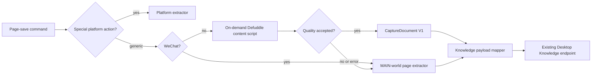

# Generic web capture architecture

## Scope boundary

This path improves only generic `save-page-link` captures. Platform actions for
小红书、抖音、YouTube、知乎、B 站 and other social sites retain their existing
extractors. Selection, link, image, video, side panel, browser MCP, and Desktop
bridge contracts are not part of this path.

WeChat (`mp.weixin.qq.com`) uses a dedicated MAIN-world capture function,
including rich HTML extraction and image localization.

## Runtime flow

The content script is injected only when the user asks to save a generic page.
It receives a detached DOM clone, sanitizes extracted HTML with DOMPurify, and
does not observe, patch, or render the page.

## Contract rules

- `CaptureDocument V1` is internal to the extension. It is mapped to the
  stable page-entry payload before calling the Knowledge endpoint.
- Source URL and `page-${hash(sourceUrl)}` external ID remain unchanged. No
  separate storage entity or alternate dedupe rule is introduced.
- A 5-second tab-and-URL cache prevents repeated click work. It is invalidated
  on navigation and tab removal.
- A blocked, sparse, timed-out, or failed Defuddle result uses the page
  extractor. It is observable in extension logs as `generic-capture-page-extractor`.

## Tests and maintenance

`pnpm test:generic-capture` exercises payload mapping, URL safety,
challenge/sparse-page handling, a representative Defuddle fixture, cache rules,
and CaptureDocument conversion. `pnpm verify` asserts the new bundle exists and
the built extension still contains explicit page and WeChat extraction paths.

The dependencies are intentionally narrow: `defuddle` extracts generic article
content, `dompurify` sanitizes retained HTML, and development-only `linkedom`
provides DOM fixtures. The internal Markdown field remains optional: the current
Knowledge endpoint consumes `text` and `html`, so the extension intentionally
does not load Defuddle's roughly 600 KiB Markdown renderer. Do not add template
DSLs, reader-mode UI, storage models, or browser-control protocol changes to
this subsystem.
