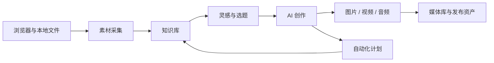

# GardenFlow

[English](./README_EN.md) · 简体中文


**本地优先的 AI 内容全链路工作台。** GardenFlow 把内容采集、知识沉淀、灵感发现、AI 创作、多媒体生成和自动化计划放进一套桌面工作流，让创作者从资料到可交付作品不再来回切换工具。

> GardenFlow 是非商业用途的源码开放（source-available）项目，并非采用 OSI 认可许可证的开源软件。使用前请阅读[许可证](./LICENSE)。


## 为什么选择 GardenFlow

- **内容上下文不散落**：素材、引用、会话、稿件和媒体资产围绕同一空间组织。
- **从研究直接进入创作**：浏览器采集进入知识库，灵感池再把证据和选题交给创作工作台。
- **模型由你控制**：支持 OpenAI、Anthropic、Gemini、本地模型和自定义兼容服务；新安装默认不连接任何 AI 服务。
- **多媒体是工作流的一部分**：图片、视频、音频生成结果进入统一媒体库，可继续用于封面、稿件和视频工程。
- **自动化可见、可停、可复核**：计划任务、执行状态和产物在本地留档，不依赖 GardenFlow 官方账号。
- **隐私边界清楚**：工作空间、SQLite 数据库和诊断记录默认在本机；没有使用分析和自动诊断上传。

## 产品流程



## 产品界面

以下截图来自同一个实际使用中的 GardenFlow 空间，展示的是已有素材、选题、稿件和媒体产物，而不是静态原型。

### 从采集素材到形成选题

| 浏览器采集后的素材库 | 带证据与评分的灵感桌 |
| --- | --- |
|  |  |

### 带引用、任务耗时与稿件结果的 AI 创作


### 统一媒体库与自动化计划

| 图片、视频与音频资产 | 定时任务与插件就绪诊断 |
| --- | --- |
|  |  |

深色模式保留相同的信息层级与操作密度：


## 能力矩阵

| 阶段 | 能力 | 主要产物 |
| --- | --- | --- |
| 采集 | Chrome/Edge/Brave 扩展、小红书结构化采集、通用网页正文提取、本地文件导入 | 网页快照、素材条目、引用来源 |
| 知识 | 文档索引、全文检索、向量检索、来源回看、空间隔离 | 可检索知识库 |
| 灵感 | 素材漫步、评论洞察、候选选题、证据绑定 | 选题与创作方向 |
| 创作 | 多会话 AI、引用上下文、任务时间线、结构化小红书稿件、封面工作台 | 文章、脚本、卡片、封面 |
| 生成 | 图片、视频、音频、语音、视频工程与字幕 | 媒体资产与工程文件 |
| 自动化 | 定时任务、内置采集任务、后台执行、审批与运行记录 | 可追踪任务和产物 |

具体能力取决于所配置供应商的协议和模型支持范围。

## 快速开始

### 环境要求

- Node.js 22
- pnpm 10.28.2
- macOS、Windows 或 Linux；打包目标以 `desktop/package.json` 为准
- 原生依赖构建工具。macOS 可执行 `xcode-select --install`

### 源码运行

```bash
git clone https://github.com/Garden12138/garden-flow.git
cd garden-flow
corepack enable
pnpm run setup
pnpm dev
```

首次启动会创建当前 GardenFlow 数据目录、`gardenflow.db` 和默认空间。随后打开“设置 → AI 服务”添加供应商并为文本、图片、视频、音频或 Embedding 选择路由。

### 常用命令

| 命令 | 用途 |
| --- | --- |
| `pnpm run setup` | 按锁文件安装根目录、两个扩展和桌面端依赖 |
| `pnpm dev` | 准备本地运行时并启动 Vite + Electron |
| `pnpm check` | 品牌、文档、接口、类型和扩展检查 |
| `pnpm test` | 运行桌面端 Node.js 测试 |
| `pnpm build` | 构建当前平台的无签名桌面安装包 |
| `pnpm build:plugin` | 构建采集扩展与发布扩展 |

## 配置 AI 供应商

GardenFlow 不提供共享密钥或默认云端网关。新安装的 AI 路由为 `disabled`；保存有效供应商并选择模型后才会启用。

| 类型 | 适合场景 | 必填项 |
| --- | --- | --- |
| OpenAI | 文本、视觉、图片等 OpenAI API 能力 | API Key、模型；自定义代理时填写 Endpoint |
| Anthropic | Claude 文本与视觉 | API Key、模型 |
| Gemini | Gemini 文本与多模态 | API Key、模型 |
| 本地服务 | Ollama、LM Studio、vLLM、LocalAI 等 | Endpoint、模型；允许空 Key |
| 自定义 | OpenAI-compatible 或项目支持的原生协议 | 协议、Endpoint、Key、模型 |

视频预设为 `aliyun-bailian`、`minimax`、`new-api-aliyun`、`new-api-minimax` 或 `custom`。两类 `new-api` 预设必须显式选择并填写 Endpoint、Key 和模型，GardenFlow 不会根据 URL 或模型名猜测上游。

完整说明见 [AI 供应商配置](./Docs/AI_PROVIDERS.md)。

## 浏览器扩展

```bash
pnpm build:plugin
```

在 Chrome、Edge 或 Brave 的扩展管理页开启开发者模式，加载 `Plugin/dist/extension/`。然后在 GardenFlow 的“设置 → 浏览器插件”点击“准备浏览器插件”，安装当前 Native Messaging Host 并检查连接。

扩展只把用户明确采集的内容传给本机 GardenFlow；诊断最多在浏览器本地保存 40 条脱敏记录，仅在用户点击导出时生成报告。详见 [浏览器扩展说明](./Plugin/README.md)。

## 架构摘要

```text
React renderer
      │ typed bridge / IPC
Electron main ── AI runtime / tools / automation
      │                    │
SQLite + workspace         └── user-configured providers
      │
Native Messaging ── browser extensions
```

- `desktop/src/`：React、TypeScript、TailwindCSS renderer。
- `desktop/electron/`：Electron 主进程、SQLite、AI runtime、工具、媒体和自动化服务。
- `Plugin/`：内容采集与浏览器控制扩展。
- `PublishPlugin/`：小红书发布辅助扩展。
- `desktop/src/vendor/freecut/`：带独立归属声明的 FreeCut 工程能力。

深入了解见[架构文档](./Docs/ARCHITECTURE.md)。

## 数据与隐私

- 数据库：当前用户数据目录中的 `gardenflow.db`。
- 工作空间：用户选择的目录；默认内部目录为 `.gardenflow`。
- API Key：保存在本地应用设置中，仅发送给用户选择的供应商。
- 诊断：本地有界记录，导出时剔除 Cookie、Token、密钥、网页正文、Data URI 和绝对路径。
- 网络：核心功能可离线管理资料；AI、网页采集、模型下载和发布功能按操作访问相应第三方服务。

## 文档

- [文档导航](./Docs/README.md)
- [使用手册](./Docs/USER_MANUAL.md)
- [本地开发与部署](./Docs/LOCAL_DEPLOYMENT.md)
- [AI 供应商配置](./Docs/AI_PROVIDERS.md)
- [测试与验收](./Docs/TESTING.md)
- [安装包构建](./Docs/PACKAGING.md)
- [贡献指南](./CONTRIBUTING.md)
- [安全策略](./SECURITY.md)

## 参与贡献

欢迎报告缺陷、提出功能建议或提交 Pull Request。开始前请阅读 [CONTRIBUTING.md](./CONTRIBUTING.md) 和 [CODE_OF_CONDUCT.md](./CODE_OF_CONDUCT.md)。安全问题请按 [SECURITY.md](./SECURITY.md) 私下报告，不要公开披露密钥或个人数据。

## 许可证

Copyright © Garden12138。

本仓库按 [GardenFlow Source-Available License (Non-Commercial)](./LICENSE) 提供，允许非商业使用、学习、修改和分发，商业使用需要事先书面授权。商业授权请通过仓库所有者的 GitHub 联系方式沟通。

第三方依赖与 vendored 代码继续适用其各自许可证；详见仓库中的 `THIRD_PARTY_NOTICES`、`ATTRIBUTION` 和依赖声明。
