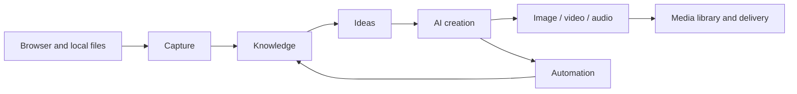

# GardenFlow

**Turn collected sources into drafts and covers, with references you can revisit.**

GardenFlow is a local-first AI content workspace that brings sources, ideas, writing and media assets together.

[Download](https://github.com/Garden12138/garden-flow/releases/latest) · [Watch the demo](./Docs/DEMO.md) · [First creation](./Docs/FIRST_CREATION_EN.md) · [简体中文](./README.md)

[](./Docs/DEMO.md)

- **Write from your existing sources**, keeping references and citations.
- **Organize sources, conversations, drafts and covers together** in one workspace.
- **Choose your model providers**, with workspace data stored locally.

> [First creation](./Docs/FIRST_CREATION_EN.md) requires your own text-model configuration; covers need a separate image service. External providers may charge for requests. GardenFlow uses a [non-commercial source-available license](./LICENSE), not an OSI-approved open source license.

If this workflow is useful to you, star the repository for updates or share feedback in [Discussions](https://github.com/Garden12138/garden-flow/discussions).

## Start with one introduction

[Introduce GardenFlow with GardenFlow](./Docs/FIRST_CREATION_EN.md): download the public sample → add it to your knowledge library → choose an angle → write with sources and save → optionally generate a cover. The tutorial includes input material and prompts; finish a text draft before enabling more capabilities.

## Why GardenFlow

- **Research flows into creation** through browser capture, the knowledge base and evidence-backed ideas.
- **One media library** for images, video, audio, covers and projects. Available capabilities depend on the configured model.
- **Observable automation** with schedules, run state, approvals and local artifacts.
- **Clear privacy boundaries**: no usage analytics or automatic diagnostic uploads. External AI requests go to the provider you select.

## Workflow



## Product tour

These screenshots come from one actively used GardenFlow workspace. They show existing sources, ideas, drafts, and generated media rather than static mockups.


### From captured sources to a scored idea

| Library after browser capture | Evidence-backed ideation desk |
| --- | --- |
|  |  |

### AI creation with references, elapsed time, and a saved draft


### One media library and observable automation

| Image, video, and audio assets | Scheduled jobs and extension readiness |
| --- | --- |
|  |  |

The dark theme keeps the same hierarchy and information density:


## Capability matrix

| Stage | Capabilities | Outputs |
| --- | --- | --- |
| Capture | Chrome/Edge/Brave extension, structured Xiaohongshu capture, generic article extraction, local imports | Source records and citations |
| Knowledge | Document indexing, full-text and vector search, source inspection, isolated spaces | Searchable knowledge base |
| Ideation | Source exploration, comment insights, idea candidates, evidence binding | Topics and creative directions |
| Creation | Multi-session AI, citations, task timeline, structured Xiaohongshu drafts, cover studio | Articles, scripts, cards, covers |
| Generation | Image, video, audio, voice, subtitles, and video projects | Media assets and project files |
| Automation | Scheduled tasks, built-in capture jobs, background runs, approvals, local run history | Traceable tasks and artifacts |

Exact availability depends on the protocols and models offered by your configured providers.

## Quick start

### Install a release build

Download the public package for your platform from [GitHub Releases](https://github.com/Garden12138/garden-flow/releases/latest): DMG for macOS Apple Silicon (arm64) or Intel (x64), an x64 installer for Windows, and AppImage or deb for Linux x64.

Current public packages are not Apple-notarized or Windows code-signed, so the operating system may display a security warning on first launch. GardenFlow uses a non-commercial source-available license rather than an OSI-approved open-source license; installation and use remain subject to the repository [LICENSE](./LICENSE).

After installation, follow [First creation](./Docs/FIRST_CREATION_EN.md). Release users do not need Node.js or pnpm; the browser extension can be prepared and exported from the app.

### Run from source


Requirements: Node.js 22, pnpm 10.28.2, and native build tools. On macOS, install Command Line Tools with `xcode-select --install`.

```bash
git clone https://github.com/Garden12138/garden-flow.git
cd garden-flow
corepack enable
pnpm run setup
pnpm dev
```

On first launch GardenFlow creates the current user-data directory, `gardenflow.db`, and a default space. Open **Settings → AI Providers**, add a provider, and select routes for text, image, video, audio, or embeddings.

| Command | Purpose |
| --- | --- |
| `pnpm run setup` | Install locked dependencies for the root, both extensions, and desktop app |
| `pnpm dev` | Prepare local runtimes and start Vite + Electron |
| `pnpm check` | Run brand, docs, interface, type, and extension checks |
| `pnpm test` | Run desktop Node.js tests |
| `pnpm build` | Build an unsigned desktop package for the current platform |
| `pnpm build:plugin` | Build the capture and publishing extensions |

## AI providers

GardenFlow ships no shared key or default cloud gateway. New installations use the `disabled` route until a valid provider and model are saved.

| Type | Typical use | Required configuration |
| --- | --- | --- |
| OpenAI | Text, vision, image, and other OpenAI API capabilities | API key and model; endpoint for a custom proxy |
| Anthropic | Claude text and vision | API key and model |
| Gemini | Gemini text and multimodal | API key and model |
| Local | Ollama, LM Studio, vLLM, LocalAI, and similar servers | Endpoint and model; key may be empty |
| Custom | OpenAI-compatible or supported native protocols | Protocol, endpoint, key, and model |

Video presets are `aliyun-bailian`, `minimax`, `new-api-aliyun`, `new-api-minimax`, and `custom`. Both `new-api` presets must be chosen explicitly and require an endpoint, key, and model. GardenFlow never infers the upstream from a URL or model name.

See [AI provider configuration](./Docs/AI_PROVIDERS.md).

## Browser extension

Release users: open **Settings → Privacy and diagnostics → Browser extension** (`设置 → 隐私与诊断 → 浏览器插件`), click **Prepare extension** (`准备插件`), then **Open extension folder** (`打开插件目录`). GardenFlow exports the extension and installs or repairs the Native Messaging Host.

Enable developer mode in Chrome, Edge or Brave, load the exported unpacked directory, and keep GardenFlow open. Check the connection state in the knowledge library: prepared does not mean connected. See [First creation](./Docs/FIRST_CREATION_EN.md#optional-browser-capture).

For developers building from source:

```bash
pnpm build:plugin
```

The capture extension build is at `Plugin/dist/extension/`; install the Native Host through the app's preparation flow.

The extension sends only user-requested captures to the local GardenFlow app. It keeps at most 40 redacted diagnostic records in browser storage and exports them only on explicit request. See the [extension guide](./Plugin/README.md).

## Architecture

```text
React renderer
      │ typed bridge / IPC
Electron main ── AI runtime / tools / automation
      │                    │
SQLite + workspace         └── user-configured providers
      │
Native Messaging ── browser extensions
```

- `desktop/src/`: React, TypeScript, and TailwindCSS renderer.
- `desktop/electron/`: Electron main process, SQLite, AI runtime, tools, media, and automation.
- `Plugin/`: capture and browser-control extension.
- `PublishPlugin/`: Xiaohongshu publishing helper extension.
- `desktop/src/vendor/freecut/`: FreeCut project capabilities with separate attribution.

Read the [architecture guide](./Docs/ARCHITECTURE.md) for details.

## Data and privacy

- The database is `gardenflow.db` in the current GardenFlow user-data directory.
- User-visible files live in the selected workspace; `.gardenflow` holds internal workspace state.
- API keys stay in local app settings and are sent only to providers selected by the user.
- Local diagnostics are bounded and redact cookies, tokens, keys, page bodies, data URIs, and absolute paths before export.
- Knowledge management can work offline. AI, web capture, model downloads, and publishing contact their respective third-party services only when used.

## Documentation

- [First creation](./Docs/FIRST_CREATION_EN.md)
- [Demo and verification](./Docs/DEMO.md)
- [Roadmap](./ROADMAP.md)
- [Documentation index](./Docs/README.md)
- [User guide](./Docs/USER_MANUAL.md)
- [Local development and deployment](./Docs/LOCAL_DEPLOYMENT.md)
- [AI providers](./Docs/AI_PROVIDERS.md)
- [Testing](./Docs/TESTING.md)
- [Packaging](./Docs/PACKAGING.md)
- [Contributing](./CONTRIBUTING.md)
- [Security](./SECURITY.md)

## Contributing and license

Use [Discussions](https://github.com/Garden12138/garden-flow/discussions) for questions and workflow sharing, and [Issues](https://github.com/Garden12138/garden-flow/issues) for reproducible bugs and feature proposals. Please read [CONTRIBUTING.md](./CONTRIBUTING.md), the [roadmap](./ROADMAP.md), [CODE_OF_CONDUCT.md](./CODE_OF_CONDUCT.md), and [SECURITY.md](./SECURITY.md).

Copyright © Garden12138. GardenFlow is distributed under the [GardenFlow Source-Available License (Non-Commercial)](./LICENSE). Non-commercial study, modification, and distribution are permitted; commercial use requires prior written permission through the repository owner's GitHub contact.

Third-party dependencies and vendored code remain under their respective licenses. See the [browser extension notices](./Plugin/src/THIRD_PARTY_NOTICES.txt), [FreeCut attribution](./desktop/src/vendor/freecut/ATTRIBUTION.md), and dependency declarations.
