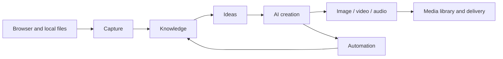

# GardenFlow

English · [简体中文](./README.md)


**A local-first, end-to-end AI content workspace.** GardenFlow brings capture, knowledge, ideation, AI writing, multimedia generation, and automation into one desktop workflow—from raw sources to a deliverable piece of content.

> GardenFlow is source-available for non-commercial use. It is not distributed under an OSI-approved open source license. Read the [license](./LICENSE) before use.


## Why GardenFlow

- **One continuous context** for sources, citations, conversations, drafts, and media.
- **Research flows into creation** through browser capture, the knowledge base, and evidence-backed ideas.
- **Bring your own models** from OpenAI, Anthropic, Gemini, a local server, or a custom compatible provider.
- **Media is part of the workflow**, not a separate download folder: images, video, audio, covers, and projects share one library.
- **Automation stays observable** with schedules, run state, approvals, and local artifacts.
- **Clear privacy boundaries**: workspaces, SQLite data, settings, and diagnostics remain local by default.

## Workflow



## Product tour

These screenshots come from one actively used GardenFlow workspace. They show existing sources, ideas, drafts, and generated media rather than static mockups.

### From captured sources to a scored idea

| Library after browser capture | Evidence-backed ideation desk |
| --- | --- |
|  |  |

### AI creation with references, elapsed time, and a saved draft


### One media library and observable automation

| Image, video, and audio assets | Scheduled jobs and extension readiness |
| --- | --- |
|  |  |

The dark theme keeps the same hierarchy and information density:


## Capability matrix

| Stage | Capabilities | Outputs |
| --- | --- | --- |
| Capture | Chrome/Edge/Brave extension, structured Xiaohongshu capture, generic article extraction, local imports | Source records and citations |
| Knowledge | Document indexing, full-text and vector search, source inspection, isolated spaces | Searchable knowledge base |
| Ideation | Source exploration, comment insights, idea candidates, evidence binding | Topics and creative directions |
| Creation | Multi-session AI, citations, task timeline, structured Xiaohongshu drafts, cover studio | Articles, scripts, cards, covers |
| Generation | Image, video, audio, voice, subtitles, and video projects | Media assets and project files |
| Automation | Scheduled tasks, built-in capture jobs, background runs, approvals, local run history | Traceable tasks and artifacts |

Exact availability depends on the protocols and models offered by your configured providers.

## Quick start

Requirements: Node.js 22, pnpm 10.28.2, and native build tools. On macOS, install Command Line Tools with `xcode-select --install`.

```bash
git clone https://github.com/Garden12138/garden-flow.git
cd garden-flow
corepack enable
pnpm run setup
pnpm dev
```

On first launch GardenFlow creates the current user-data directory, `gardenflow.db`, and a default space. Open **Settings → AI Providers**, add a provider, and select routes for text, image, video, audio, or embeddings.

| Command | Purpose |
| --- | --- |
| `pnpm run setup` | Install locked dependencies for the root, both extensions, and desktop app |
| `pnpm dev` | Prepare local runtimes and start Vite + Electron |
| `pnpm check` | Run brand, docs, interface, type, and extension checks |
| `pnpm test` | Run desktop Node.js tests |
| `pnpm build` | Build an unsigned desktop package for the current platform |
| `pnpm build:plugin` | Build the capture and publishing extensions |

## AI providers

GardenFlow ships no shared key or default cloud gateway. New installations use the `disabled` route until a valid provider and model are saved.

| Type | Typical use | Required configuration |
| --- | --- | --- |
| OpenAI | Text, vision, image, and other OpenAI API capabilities | API key and model; endpoint for a custom proxy |
| Anthropic | Claude text and vision | API key and model |
| Gemini | Gemini text and multimodal | API key and model |
| Local | Ollama, LM Studio, vLLM, LocalAI, and similar servers | Endpoint and model; key may be empty |
| Custom | OpenAI-compatible or supported native protocols | Protocol, endpoint, key, and model |

Video presets are `aliyun-bailian`, `minimax`, `new-api-aliyun`, `new-api-minimax`, and `custom`. Both `new-api` presets must be chosen explicitly and require an endpoint, key, and model. GardenFlow never infers the upstream from a URL or model name.

See [AI provider configuration](./Docs/AI_PROVIDERS.md).

## Browser extension

```bash
pnpm build:plugin
```

Enable developer mode in Chrome, Edge, or Brave and load `Plugin/dist/extension/`. In GardenFlow, open **Settings → Browser extension** and choose **Prepare browser extension** to install the current Native Messaging Host.

The extension sends only user-requested captures to the local GardenFlow app. It keeps at most 40 redacted diagnostic records in browser storage and exports them only on explicit request. See the [extension guide](./Plugin/README.md).

## Architecture

```text
React renderer
      │ typed bridge / IPC
Electron main ── AI runtime / tools / automation
      │                    │
SQLite + workspace         └── user-configured providers
      │
Native Messaging ── browser extensions
```

- `desktop/src/`: React, TypeScript, and TailwindCSS renderer.
- `desktop/electron/`: Electron main process, SQLite, AI runtime, tools, media, and automation.
- `Plugin/`: capture and browser-control extension.
- `PublishPlugin/`: Xiaohongshu publishing helper extension.
- `desktop/src/vendor/freecut/`: FreeCut project capabilities with separate attribution.

Read the [architecture guide](./Docs/ARCHITECTURE.md) for details.

## Data and privacy

- The database is `gardenflow.db` in the current GardenFlow user-data directory.
- User-visible files live in the selected workspace; `.gardenflow` holds internal workspace state.
- API keys stay in local app settings and are sent only to providers selected by the user.
- Local diagnostics are bounded and redact cookies, tokens, keys, page bodies, data URIs, and absolute paths before export.
- Knowledge management can work offline. AI, web capture, model downloads, and publishing contact their respective third-party services only when used.

## Documentation

- [Documentation index](./Docs/README.md)
- [User guide](./Docs/USER_MANUAL.md)
- [Local development and deployment](./Docs/LOCAL_DEPLOYMENT.md)
- [AI providers](./Docs/AI_PROVIDERS.md)
- [Testing](./Docs/TESTING.md)
- [Packaging](./Docs/PACKAGING.md)
- [Contributing](./CONTRIBUTING.md)
- [Security](./SECURITY.md)

## Contributing and license

Bug reports, feature proposals, and pull requests are welcome. Please read [CONTRIBUTING.md](./CONTRIBUTING.md), [CODE_OF_CONDUCT.md](./CODE_OF_CONDUCT.md), and [SECURITY.md](./SECURITY.md).

Copyright © Garden12138. GardenFlow is distributed under the [GardenFlow Source-Available License (Non-Commercial)](./LICENSE). Non-commercial study, modification, and distribution are permitted; commercial use requires prior written permission through the repository owner's GitHub contact.

Third-party dependencies and vendored code remain under their respective licenses. See the repository's `THIRD_PARTY_NOTICES`, `ATTRIBUTION`, and dependency declarations.
